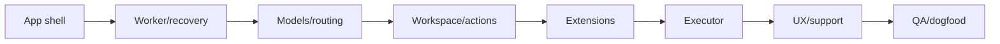
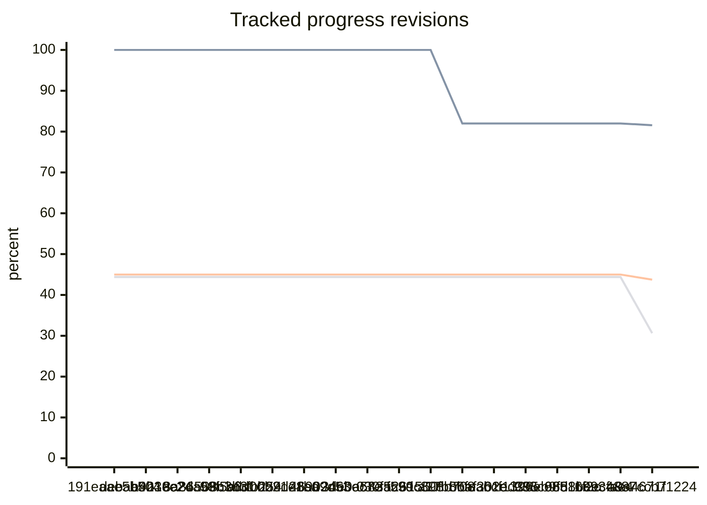

# Project codename: Jarvis

**Jarvis je interní codename projektu ve vývoji, nikoli finální produktový název.**

Cílem je bezplatná edice **Personal 1.0.0**. Až bude připravená k veřejnému vydání, bude zde zveřejněna pod jiným produktovým názvem.

Aktuálně zde není žádný veřejný instalační balíček ke stažení. Dřívější vývojové a beta buildy byly z aktuálního download kanálu odstraněny, protože neodpovídají cílové kvalitě a rozsahu verze 1.0.0.

<!-- JARVIS_IMPLEMENTATION_PROGRESS_BEGIN -->
## Personal 1.0.0 implementation tracking

**Synchronizovaný snapshot: 2026-08-23**

Hlavní číslo je konzervativní index z explicitních milestone evidence. Surový Task Board claim je zobrazen odděleně jako auditní srovnání; vyšší TB číslo se automaticky nepovažuje za skutečný stav implementace.

| Metrika | Hodnota | Význam |
| --- | ---: | --- |
| Primární evidence index | 30.63 % | Vážený výsledek milestone evidence po stropech kapitol; toto je hlavní veřejné číslo |
| Task Board claim (audit) | 81.56 % | Surový nárok TB; není primárním tvrzením o implementaci |
| Implementace z evidence | 43.75 % | Vážená implementační část deklarovaných milestone stavů |
| Ověření z evidence | 30.63 % | Vážené aktuální build/contract/runtime důkazy |
| Hotovo z evidence | 30.63 % | Vážené minimum implementace a ověření na jednotlivých milnících |
| Raw TB implementation (audit) | 83.96 % | Surová hodnota z TB, pouze pro srovnání |
| Raw TB verification (audit) | 76.72 % | Surová hodnota z TB, pouze pro srovnání |
| Release readiness | 50.00 % | Samostatná roadmapová release metrika |

### Architektonické kapitoly

| Architektonická kapitola | Váha | TB claim | Evidence impl. | Evidence ověř. | Hotovo | Stav | Milníky |
| --- | ---: | ---: | ---: | ---: | ---: | --- | ---: |
| Aplikační shell, instalátor, update a veřejný kanál | 10.00 % | 99.00 % | 50.00 % | 31.25 % | 31.25 % | `in-progress` | 4 |
| Worker core, konverzace, fronta a recovery | 12.00 % | 88.00 % | 50.00 % | 37.50 % | 37.50 % | `in-progress` | 4 |
| Model providery, profily, routing a fallback | 10.00 % | 76.00 % | 75.00 % | 56.25 % | 56.25 % | `in-progress` | 4 |
| Workspace, memory, source, patch, build, Git a web | 14.00 % | 99.00 % | 75.00 % | 62.50 % | 62.50 % | `in-progress` | 4 |
| Extension discovery, manager a permissions | 16.00 % | 66.00 % | 25.00 % | 6.25 % | 6.25 % | `in-progress` | 4 |
| Policy-bound MCP, plugin a app executor runtime | 20.00 % | 75.00 % | 25.00 % | 18.75 % | 18.75 % | `in-progress` | 4 |
| Owner-facing UX, diagnostika, support a lokalizace | 10.00 % | 72.00 % | 37.50 % | 18.75 % | 18.75 % | `in-progress` | 4 |
| End-to-end QA, dogfooding a bezpečnostní audity | 8.00 % | 86.00 % | 25.00 % | 25.00 % | 25.00 % | `in-progress` | 4 |

### Stav kapitol v grafu

```mermaid
xychart-beta
    title "Architecture chapters"
    x-axis ["App shell", "Worker/recovery", "Models/routing", "Workspace/actions", "Extensions", "Executor", "UX/support", "QA/dogfood"]
    y-axis "percent" 0 --> 100
    bar [50.00, 50.00, 75.00, 75.00, 25.00, 25.00, 37.50, 25.00]
    bar [31.25, 37.50, 56.25, 62.50, 6.25, 18.75, 18.75, 25.00]
    bar [31.25, 37.50, 56.25, 62.50, 6.25, 18.75, 18.75, 25.00]
```

Pořadí grafu je vždy `implementace z evidence`, `ověření z evidence`, `hotovo`; přesná čísla a surové TB hodnoty jsou v tabulce a `progress.json`.

### Milestone evidence

| Kapitola | Milestone | Stav | Váha | Implementace | Ověření | Hotovo | Evidence | Ověřené důkazy | Důkaz / mezera |
| --- | --- | --- | ---: | ---: | ---: | ---: | ---: | ---: | --- |
| App shell | WDUi aplikační shell a základní navigace | `verified-build` | 25.00 % | 100.00 % | 75.00 % | 75.00 % | 2 (build, runtime) | 1 | Aktuální capability evidence uvádí warning-free build a contract/self-test gates pro WDUi/Jarvis vrstvy.; mezera: Čerstvé owner-facing vizuální a multi-monitor QA není uzavřené jako runtime acceptance. |
| App shell | Instalátor, update a rollback kontrakt | `partial` | 25.00 % | 50.00 % | 25.00 % | 25.00 % | 2 (contract, release-gate) | 1 | Instalační a update části jsou v architektuře a zdrojovém toku přítomné, ale veřejná P8 release QA je pouze partial.; mezera: Chybí uzavřený čistý install, upgrade a rollback acceptance pack pro Personal 1.0.0. |
| App shell | ADPU a veřejný kanál | `partial` | 25.00 % | 50.00 % | 25.00 % | 25.00 % | 2 (contract, release-gate) | 1 | Veřejný kanál a synchronizační kontrakt existují, ale samotná distribuce není důkazem funkčního release.; mezera: Je nutné dokončit a opakovaně ověřit end-to-end publikaci artefaktu, integritu a rollback hranice. |
| App shell | Čistá instalace, upgrade, podpis a rollback acceptance | `open` | 25.00 % | 0.00 % | 0.00 % | 0.00 % | 1 (roadmap) | 0 | Release milestone je deklarovaný jako požadavek, nikoli jako uzavřený důkaz.; mezera: Chybí aktuální acceptance pack navázaný na konkrétní release candidate. |
| Worker/recovery | Queue, WorkerJournal a persistence | `verified-build` | 25.00 % | 100.00 % | 75.00 % | 75.00 % | 2 (runtime, self-test) | 1 | Capability matrix uvádí queue, worker a durable evidence gates jako build/contract ověřené.; mezera: Dlouhý crash/restart dogfood v reálném workflow zůstává samostatným důkazem. |
| Worker/recovery | Mid-step resume a přesný Fragment | `verified-contract` | 25.00 % | 100.00 % | 50.00 % | 50.00 % | 2 (contract, runtime) | 1 | Typed phase, target, digest a exact Fragment selection mají kontraktní self-test evidence.; mezera: Live provider replay a pokračování po skutečné mutaci nejsou tímto kontraktem prokázané. |
| Worker/recovery | Fail-closed review pro síťové a mutující replaye | `partial` | 25.00 % | 50.00 % | 25.00 % | 25.00 % | 2 (contract, runtime) | 1 | Fail-closed hranice jsou součástí kontraktů a policy runtime, ale jejich úplná Personal acceptance není uzavřená.; mezera: Chybí jednotný live receipt přes všechny privilegované a mutující replay cesty. |
| Worker/recovery | Crash/restart dogfood skutečného workflow | `open` | 25.00 % | 0.00 % | 0.00 % | 0.00 % | 1 (roadmap) | 0 | Roadmap požadavek je známý, ale aktuální receipt není v registru.; mezera: Dodat opakovatelný crash/restart test s identity, journalem, resume a owner review. |
| Models/routing | Provider health, capability a identity | `verified-build` | 25.00 % | 100.00 % | 75.00 % | 75.00 % | 2 (runtime, self-test) | 1 | Current evidence covers provider/model identity, readiness and bounded routing contracts.; mezera: Živá dostupnost každého podporovaného endpointu není permanentně prokázaná. |
| Models/routing | Typed routing, fallback a blocked stav | `verified-build` | 25.00 % | 100.00 % | 75.00 % | 75.00 % | 2 (build, runtime) | 1 | Evidence-driven first-attempt routing a fallback gates jsou v current build evidence.; mezera: Runtime kvalita provideru a 75% first-tier KPI zůstávají measurement target, nikoli hotový výsledek. |
| Models/routing | Benchmark, idle gate a Work Report evidence | `verified-build` | 25.00 % | 100.00 % | 75.00 % | 75.00 % | 2 (runtime, self-test) | 1 | Registry, scenario validation, idle resource gate, executor a Work Report summary mají build/self-test důkaz.; mezera: Skutečný idle model run a nahromaděné live owner Work Reports nejsou nahrazeny self-testem. |
| Models/routing | Živá provider reliability a hardware-aware recommendation | `open` | 25.00 % | 0.00 % | 0.00 % | 0.00 % | 1 (roadmap) | 0 | Roadmap target existuje, ale aktuální live evidence neumožňuje tvrdit dokončení.; mezera: Dodat reproducible live replay, endpoint identity, hardware context a truthful downgrade/blocked receipt. |
| Workspace/actions | Workspace, source grounding a freshness | `verified-build` | 25.00 % | 100.00 % | 75.00 % | 75.00 % | 2 (runtime, self-test) | 1 | Workspace helpers, source grounding a deterministic project workflow mají current build evidence.; mezera: Úplná kombinatorická action matrix pro každý podporovaný projekt není uzavřená. |
| Workspace/actions | Memory, provenance a continuity | `verified-build` | 25.00 % | 100.00 % | 75.00 % | 75.00 % | 2 (contract, self-test) | 1 | Global memory capture, retrieval, scope nodes, citations and owner review mají executable evidence.; mezera: Semantic inference, online sync a všechny current-state correction scénáře nejsou tímto důkazem uzavřené. |
| Workspace/actions | Policy-bound file/build/test/Git/web akce | `verified-build` | 25.00 % | 100.00 % | 75.00 % | 75.00 % | 2 (runtime, self-test) | 1 | Policy-bound helper and workspace command paths mají fail-closed selection, output capture a journal evidence.; mezera: Live owner acceptance všech mutujících a browser/app cest není doložená jedním kompletním packem. |
| Workspace/actions | Recovery po selhání nástroje a no-overwrite hranice | `partial` | 25.00 % | 50.00 % | 25.00 % | 25.00 % | 2 (contract, runtime) | 1 | Bezpečnostní guardy a recovery kontrakty existují, ale nejsou kompletně potvrzené napříč runtime cestami.; mezera: Dodat end-to-end receipts pro containment, no-overwrite, destructive guard a recovery po pádu procesu. |
| Extensions | Registry a discovery rozšíření | `partial` | 25.00 % | 50.00 % | 25.00 % | 25.00 % | 2 (contract, release-gate) | 1 | Kontrakt discovery a capability boundary existují, ale P7 je owner-approved pouze early.; mezera: Chybí uzavřená registrace/discovery lifecycle evidence pro obecné extension typy. |
| Extensions | Capability center a permission profily | `contract-only` | 25.00 % | 25.00 % | 0.00 % | 0.00 % | 1 (documentation) | 0 | Permission model je architektonicky popsaný; kompletní current runtime evidence chybí.; mezera: Dodat implementovaný UI/runtime flow, persistence a negative-path self-tests. |
| Extensions | Read-only connector preview | `contract-only` | 25.00 % | 25.00 % | 0.00 % | 0.00 % | 1 (roadmap) | 0 | Read-only preview je součástí roadmapového směru, ne uzavřený universal connector proof.; mezera: Dodat konkrétní connector fixture, source identity, permission review a ověřený render. |
| Extensions | Install/update/disable lifecycle rozšíření | `open` | 25.00 % | 0.00 % | 0.00 % | 0.00 % | 1 (release-gate) | 0 | Obecný lifecycle není v Personal evidence uzavřen.; mezera: Dodat safe install, update, disable, rollback, ownership a audit receipts. |
| Executor | Typed executor scopes a stream lifecycle | `verified-contract` | 25.00 % | 100.00 % | 50.00 % | 50.00 % | 2 (contract, runtime) | 1 | Typed executor scope contract a bounded result lifecycle mají current contract evidence.; mezera: Univerzální runtime acceptance pro každý MCP/plugin/app typ není uzavřená. |
| Executor | Policy, audit, resume a fail-closed executor | `partial` | 25.00 % | 50.00 % | 25.00 % | 25.00 % | 2 (contract, runtime) | 1 | Auditní a fail-closed principy jsou přítomné v kontraktech, ale cross-runtime proof je částečný.; mezera: Dodat jednotný audit/resume receipt a negative-path test pro všechny executor adapters. |
| Executor | MCP/plugin/app result lifecycle | `contract-only` | 25.00 % | 25.00 % | 0.00 % | 0.00 % | 1 (documentation) | 0 | Result lifecycle je v architektuře popsán, ale generic integration evidence chybí.; mezera: Dodat typed fixtures pro success, partial, failure, timeout, retry a owner review. |
| Executor | Live external integration a resume acceptance | `open` | 25.00 % | 0.00 % | 0.00 % | 0.00 % | 1 (release-gate) | 0 | Live MCP/plugin/app acceptance není doložena jako společný current receipt.; mezera: Dodat owner-approved, identity-bearing, reproducible live acceptance pack. |
| UX/support | First-run, setup a diagnostics | `partial` | 25.00 % | 50.00 % | 25.00 % | 25.00 % | 2 (build, runtime) | 1 | Diagnostické a setup směry existují, ale P8 owner-facing QA je partial.; mezera: Dodat čerstvý owner walkthrough v podporovaných DPI/multi-monitor konfiguracích. |
| UX/support | Failure/recovery a ticket UI | `partial` | 25.00 % | 50.00 % | 25.00 % | 25.00 % | 2 (contract, release-gate) | 1 | Failure/recovery and Secure Ticket contracts exist, but P6 ticket runtime is early and P8 QA partial.; mezera: Dodat live owner review, sanitizer/lineage receipt and complete ticket UI path. |
| UX/support | Jazyk, lokalizace a accessibility quality | `partial` | 25.00 % | 50.00 % | 25.00 % | 25.00 % | 2 (runtime, self-test) | 1 | Localization accounting existuje, ale fallback backlog je explicitně otevřený a není důkazem hotové kvality.; mezera: Uzavřít překladový backlog a projít accessibility/DPI acceptance na reálném UI. |
| UX/support | Owner-facing live QA | `open` | 25.00 % | 0.00 % | 0.00 % | 0.00 % | 1 (roadmap) | 0 | Žádný aktuální univerzální live owner acceptance receipt není v manifestu.; mezera: Dodat vizuální a interakční QA pack včetně accessibility, DPI a recovery scénářů. |
| QA/dogfood | Contract/self-test gates | `verified-build` | 25.00 % | 100.00 % | 75.00 % | 75.00 % | 2 (build, runtime) | 1 | Current capability matrix uvádí warning-free build a více self-test gates.; mezera: Self-test nenahrazuje dlouhý dogfood ani reálnou konfiguraci ownera. |
| QA/dogfood | Deterministic dogfood a regression fixtures | `partial` | 25.00 % | 50.00 % | 25.00 % | 25.00 % | 2 (contract, release-gate) | 1 | Contract and dogfood scaffolding exist, ale potvrzené ticket-driven regression closure není úplné.; mezera: Navázat potvrzené chyby na immutable acceptance pack a regression fixture. |
| QA/dogfood | Reálný hardware/configuration matrix | `open` | 25.00 % | 0.00 % | 0.00 % | 0.00 % | 1 (release-gate) | 0 | Owner-approved release source označuje hardware/configuration matrix jako early.; mezera: Dodat opakovatelná měření na skutečných konfiguracích s identity a environment receipts. |
| QA/dogfood | Release acceptance pack a bezpečnostní audit | `open` | 25.00 % | 0.00 % | 0.00 % | 0.00 % | 1 (release-gate) | 0 | Release readiness je samostatně 50 %, ale neprokazuje dokončený safety/release acceptance pack.; mezera: Dodat current release candidate, signed artifacts, clean install/upgrade/rollback a safety audit receipts. |

```mermaid
flowchart TD
    G1[App shell 31.25%]
    G1M1[WDUi aplikační shell a základní navigace<br/>verified-build 75.00%]
    G1 --> G1M1
    G1M2[Instalátor, update a rollback kontrakt<br/>partial 25.00%]
    G1M1 --> G1M2
    G1M3[ADPU a veřejný kanál<br/>partial 25.00%]
    G1M2 --> G1M3
    G1M4[Čistá instalace, upgrade, podpis a rollback acceptance<br/>open 0.00%]
    G1M3 --> G1M4
    G10[Worker/recovery 37.50%]
    G10M1[Queue, WorkerJournal a persistence<br/>verified-build 75.00%]
    G10 --> G10M1
    G10M2[Mid-step resume a přesný Fragment<br/>verified-contract 50.00%]
    G10M1 --> G10M2
    G10M3[Fail-closed review pro síťové a mutující replaye<br/>partial 25.00%]
    G10M2 --> G10M3
    G10M4[Crash/restart dogfood skutečného workflow<br/>open 0.00%]
    G10M3 --> G10M4
    G19[Models/routing 56.25%]
    G19M1[Provider health, capability a identity<br/>verified-build 75.00%]
    G19 --> G19M1
    G19M2[Typed routing, fallback a blocked stav<br/>verified-build 75.00%]
    G19M1 --> G19M2
    G19M3[Benchmark, idle gate a Work Report evidence<br/>verified-build 75.00%]
    G19M2 --> G19M3
    G19M4[Živá provider reliability a hardware-aware recommendation<br/>open 0.00%]
    G19M3 --> G19M4
    G28[Workspace/actions 62.50%]
    G28M1[Workspace, source grounding a freshness<br/>verified-build 75.00%]
    G28 --> G28M1
    G28M2[Memory, provenance a continuity<br/>verified-build 75.00%]
    G28M1 --> G28M2
    G28M3[Policy-bound file/build/test/Git/web akce<br/>verified-build 75.00%]
    G28M2 --> G28M3
    G28M4[Recovery po selhání nástroje a no-overwrite hranice<br/>partial 25.00%]
    G28M3 --> G28M4
    G37[Extensions 6.25%]
    G37M1[Registry a discovery rozšíření<br/>partial 25.00%]
    G37 --> G37M1
    G37M2[Capability center a permission profily<br/>contract-only 0.00%]
    G37M1 --> G37M2
    G37M3[Read-only connector preview<br/>contract-only 0.00%]
    G37M2 --> G37M3
    G37M4[Install/update/disable lifecycle rozšíření<br/>open 0.00%]
    G37M3 --> G37M4
    G46[Executor 18.75%]
    G46M1[Typed executor scopes a stream lifecycle<br/>verified-contract 50.00%]
    G46 --> G46M1
    G46M2[Policy, audit, resume a fail-closed executor<br/>partial 25.00%]
    G46M1 --> G46M2
    G46M3[MCP/plugin/app result lifecycle<br/>contract-only 0.00%]
    G46M2 --> G46M3
    G46M4[Live external integration a resume acceptance<br/>open 0.00%]
    G46M3 --> G46M4
    G55[UX/support 18.75%]
    G55M1[First-run, setup a diagnostics<br/>partial 25.00%]
    G55 --> G55M1
    G55M2[Failure/recovery a ticket UI<br/>partial 25.00%]
    G55M1 --> G55M2
    G55M3[Jazyk, lokalizace a accessibility quality<br/>partial 25.00%]
    G55M2 --> G55M3
    G55M4[Owner-facing live QA<br/>open 0.00%]
    G55M3 --> G55M4
    G64[QA/dogfood 25.00%]
    G64M1[Contract/self-test gates<br/>verified-build 75.00%]
    G64 --> G64M1
    G64M2[Deterministic dogfood a regression fixtures<br/>partial 25.00%]
    G64M1 --> G64M2
    G64M3[Reálný hardware/configuration matrix<br/>open 0.00%]
    G64M2 --> G64M3
    G64M4[Release acceptance pack a bezpečnostní audit<br/>open 0.00%]
    G64M3 --> G64M4
```

Veřejná tabulka uvádí pouze agregovaný typ a počet důkazů. Detailní privátní zdrojové cesty, receipts a owner-specific data zůstávají v CPM evidence manifestu.

### Vývoj v relevantních revizích

Pořadí historického grafu je `primary`, `TB claim audit`, `implementace z evidence`, `ověření z evidence`. Každá revize je veřejně označena neprůhledným fingerprintem; raw private source commit, subject ani interní cesta se do veřejného repa nekopírují.

| Veřejná revize | Datum | Δ primary | Δ TB claim | Δ implementace | Δ ověření | Δ hotovo | Změněné kapitoly | Milestone evidence events |
| --- | --- | ---: | ---: | ---: | ---: | ---: | --- | --- |
| `191eaae5b504` | 2026-08-10 | +0.00 | +0.00 | +0.00 | +0.00 | +0.00 | evidence-only | — |
| `debaa423ec24` | 2026-08-10 | +0.00 | +0.00 | +0.00 | +0.00 | +0.00 | evidence-only | — |
| `b9b19e2da59b` | 2026-08-10 | +0.00 | +0.00 | +0.00 | +0.00 | +0.00 | evidence-only | — |
| `8a86508c3b31` | 2026-08-10 | +0.00 | +0.00 | +0.00 | +0.00 | +0.00 | evidence-only | — |
| `98f5afbfb254` | 2026-08-10 | +0.00 | +0.00 | +0.00 | +0.00 | +0.00 | evidence-only | — |
| `b6d00b21e1ba` | 2026-08-10 | +0.00 | +0.00 | +0.00 | +0.00 | +0.00 | evidence-only | — |
| `b29d28a09d53` | 2026-08-10 | +0.00 | +0.00 | +0.00 | +0.00 | +0.00 | evidence-only | — |
| `4690246bec7e` | 2026-08-10 | +0.00 | +0.00 | +0.00 | +0.00 | +0.00 | evidence-only | — |
| `3de0a5835c99` | 2026-08-10 | +0.00 | +0.00 | +0.00 | +0.00 | +0.00 | evidence-only | — |
| `030fa261550f` | 2026-08-11 | +0.00 | +0.00 | +0.00 | +0.00 | +0.00 | evidence-only | — |
| `f53dc898b708` | 2026-08-15 | +0.00 | +0.00 | +0.00 | +0.00 | +0.00 | evidence-only | — |
| `a17b86feab1e` | 2026-08-16 | +0.00 | -18.00 | +0.00 | +0.00 | +0.00 | rollup-correction | — |
| `bbaf302ed395` | 2026-08-16 | +0.00 | +0.00 | +0.00 | +0.00 | +0.00 | evidence-only | — |
| `6cf1396eb9fd` | 2026-08-19 | +0.00 | +0.00 | +0.00 | +0.00 | +0.00 | evidence-only | — |
| `938c68511f2c` | 2026-08-19 | +0.00 | +0.00 | +0.00 | +0.00 | +0.00 | evidence-only | — |
| `9688beecfae4` | 2026-08-20 | +0.00 | +0.00 | +0.00 | +0.00 | +0.00 | evidence-only | — |
| `68934887ccb7` | 2026-08-22 | +0.00 | +0.00 | +0.00 | +0.00 | +0.00 | evidence-only | — |
| `a9a4671f1224` | 2026-08-23 | -13.77 | -0.44 | -1.25 | -13.77 | -13.77 | app-shell-release, worker-recovery, model-routing, workspace-actions, extensions-permissions, executor-runtime, owner-ux, qa-dogfood | 32: app-shell-release/wdui-shell-contract, app-shell-release/installer-update-contract, app-shell-release/adpu-public-channel, app-shell-release/clean-release-acceptance… |

Úplná machine-readable historie: [progress-history.json](progress-history.json). Snapshot: [progress.json](progress.json). Evidovaných revizí: **94**.

### Release readiness

| Release oblast | Stav | Readiness |
| --- | --- | ---: |
| Recovery a durable execution | `partial` | 50.00 % |
| Model/provider spolehlivost | `advanced` | 75.00 % |
| Intake, research a source quality | `partial` | 50.00 % |
| Workspace a bezpečné akce | `advanced` | 75.00 % |
| Memory a continuity | `advanced` | 75.00 % |
| Secure Support Ticket | `early` | 25.00 % |
| Supervised self-development | `early` | 25.00 % |
| UX, installer, update a release QA | `partial` | 50.00 % |
| Reálný hardware/configuration matrix | `early` | 25.00 % |

### Měřicí kontrakt

- `primary`: vážené `min(implementace, ověření)` po jednotlivých milnících; milník bez ověřeného důkazu nemůže vytvořit hotovo.
- `implementation`: explicitní milestone state; `contract-only` je nejvýše 25 %, `partial` nejvýše 50 %, buildově ověřený stav nejvýše 100 % implementace.
- `verification`: explicitní evidence; `verified-contract` je nejvýše 50 %, `verified-build` nejvýše 75 % a 100 % vyžaduje runtime/owner acceptance state.
- `done`: vážené minimum na každém milníku, potom vážený roll-up kapitol a jejich evidence cap.
- `Task Board claim`: zůstává auditní hodnota pro synchronizaci, ale veřejný primary ji nepoužívá jako důkaz.
- Relevantní revize vzniká při změně nakonfigurovaných vstupů měření; commit bez evidence změny má delta `0.00` a je označen `evidence-only`.
- Plánovaný stav, historická dokumentace, source-size ani samotný commit nemohou zvýšit primary bez evidence manifestu.
<!-- JARVIS_IMPLEMENTATION_PROGRESS_END -->

## Co se připravuje

Personal 1.0.0 má být local-first osobní agent pro Windows, který může používat lokální modely, modely v LAN i uživatelem zvoleného providera a nemá vyžadovat povinný Jeniksoft inference cloud ani Jeniksoft tokenové platby.

Vývoj se nyní soustředí především na spolehlivost, recovery, bezpečnost akcí, práci s evidencí a zdroji, memory, support/reprodukci chyb, supervised self-development, instalaci/rollback a ověření na různých skutečných počítačích.

## Dostupnost

Veřejné datum vydání zatím není stanoveno. Verze 1.0.0 bude zveřejněna až po splnění release gates; samotný počet implementovaných funkcí není důvodem označit build za hotový.
