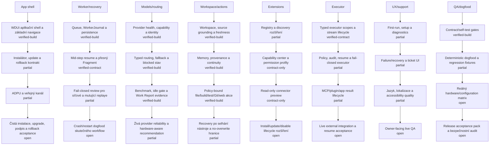

# Project codename: Jarvis

**Jarvis je interní codename projektu ve vývoji, nikoli finální produktový název.**

Cílem je bezplatná edice **Personal 1.0.0**. Až bude připravená k veřejnému vydání, bude zde zveřejněna pod jiným produktovým názvem.

Aktuálně zde není žádný veřejný instalační balíček ke stažení. Dřívější vývojové a beta buildy byly z aktuálního download kanálu odstraněny, protože neodpovídají cílové kvalitě a rozsahu verze 1.0.0.

<!-- JARVIS_IMPLEMENTATION_PROGRESS_BEGIN -->
## Sledování implementace Personal 1.0.0

**Synchronizovaný snapshot: 2026-08-26**

Hlavní číslo je konzervativní index z explicitních milestone evidence. Task Board dodává pouze strukturu kapitol a synchronizaci evidence.

**Jazyk reportu:** čeština pro `cs*`; jiné locale používá anglický fallback. GitHub README je statický a jazyk se určuje při generování.

### Jarvis report

Tato stránka je veřejný report o stavu vývoje Jarvis Personal 1.0.0 vázaný na důkazy: ukazuje ověřenou implementaci, stav milestone a otevřené důkazní mezery.
Nejde o instalační balíček ani o prohlášení, že je produkt hotový; připravenost vydání je samostatná roadmapová brána.

### Grafický dashboard

Čísla jsou záměrně kreslená přímo na sloupcích, bodech, uzlech a milestone tiles. Časový graf sledovaného pokroku má na vodorovné ose anonymizované relevantní revize a delta anotace ukazují přírůstky mezi body. Tabulky níže drží stav, kontext a důkazní mezeru.

### Roadmapa produktu

Tabulka používá pevnou ✓/✕ značku: ✓ znamená ověřenou release bránu, ✕ znamená, že brána ještě není ověřená. ✕ není důkaz chyby; u architektury označuje plánovaný rozsah.

**Změna od předchozího snapshotu: roadmapa položky +2 · hotovo +1 · ověřené důkazy +0**

### Celá roadmapa — kapitoly a podřezy

Tato tabulka obsahuje všechny veřejné položky kanonické roadmapy. Barevné kapitoly jsou vidět v grafu; zde je stejný obsah dostupný i jako přesná textová tabulka. ✓ znamená deterministicky implementováno nebo doloženo aktuální evidencí; živé owner acceptance může zůstat otevřené.

| Stav | Kapitola | ID | Stručný popis | Ověření |
| --- | --- | --- | --- | --- |
| ✕ Pouze architektura | Platformní základy · PF0 — Stable identities and namespaces | `PF0.1` | identity-types inventory | `V1` |
| ✕ Pouze architektura | Platformní základy · PF0 — Stable identities and namespaces | `PF0.2` | identity normalization | `V1` |
| ✕ Pouze architektura | Platformní základy · PF0 — Stable identities and namespaces | `PF0.3` | identity negative fixtures | `V1` |
| ✕ Pouze architektura | Platformní základy · PF0 — Stable identities and namespaces | `PF0.4` | lineage contract | `V1` |
| ✓ Hotovo | Platformní základy · PF1 — Schémata, persistence a migrace | `PF1.1` | Inventář durable schémat bez mutace | `V1` |
| ✕ Částečně | Platformní základy · PF1 — Schémata, persistence a migrace | `PF1.2` | Společný UI-free envelope a parser self-test | `V1` |
| ✓ Hotovo | Platformní základy · PF1 — Schémata, persistence a migrace | `PF1.3` | Znovupoužitelný atomický zápis s crash fixture | `V1` |
| ✓ Hotovo | Platformní základy · PF1 — Schémata, persistence a migrace | `PF1.4` | Čistý plánovač migrace bez mutace dat | `V1` |
| ✓ Hotovo | Platformní základy · PF1 — Schémata, persistence a migrace | `PF1.5` | Migrační fixture old → new → rollback | `V1` |
| ✓ Hotovo | Platformní základy · PF1 — Schémata, persistence a migrace | `PF1.6` | Napojení kompatibility schémat do LKG evidence | `V1` |
| ✓ Hotovo | Platformní základy · PF2 — Time epochs and leases | `PF2.1` | time-use inventory | `V1` |
| ✓ Hotovo | Platformní základy · PF2 — Time epochs and leases | `PF2.2` | typed time helpers | `V1` |
| ✓ Hotovo | Platformní základy · PF2 — Time epochs and leases | `PF2.3` | clock rollback fixtures | `V1` |
| ✓ Hotovo | Platformní základy · PF2 — Time epochs and leases | `PF2.4` | lease envelope | `V1` |
| ✓ Hotovo | Platformní základy · PF2 — Time epochs and leases | `PF2.5` | authority epoch fixture | `V1` |
| ✕ Pouze architektura | Platformní základy · PF3 — Secrets and credential boundary | `PF3.1` | credential flow audit | `V2` |
| ✕ Pouze architektura | Platformní základy · PF3 — Secrets and credential boundary | `PF3.2` | CredentialRef types | `V2` |
| ✕ Pouze architektura | Platformní základy · PF3 — Secrets and credential boundary | `PF3.3` | local protected store adapter | `V2` |
| ✕ Pouze architektura | Platformní základy · PF3 — Secrets and credential boundary | `PF3.4` | exact alias resolution | `V2` |
| ✕ Pouze architektura | Platformní základy · PF3 — Secrets and credential boundary | `PF3.5` | redaction regression | `V2` |
| ✕ Pouze architektura | Platformní základy · PF3 — Secrets and credential boundary | `PF3.6` | revoke rotate fixture | `V2` |
| ✕ Pouze architektura | Platformní základy · PF3 — Secrets and credential boundary | `PF3.7` | credential consent assurance | `V2` |
| ✕ Pouze architektura | Platformní základy · PF3 — Secrets and credential boundary | `PF3.8` | Windows user credential store | `V2` |
| ✕ Pouze architektura | Platformní základy · PF3 — Secrets and credential boundary | `PF3.9` | exact credential executor | `V2` |
| ✕ Pouze architektura | Platformní základy · PF3 — Secrets and credential boundary | `PF3.10` | Windows login provider boundary | `V2` |
| ✕ Pouze architektura | Platformní základy · PF3 — Secrets and credential boundary | `PF3.11` | encrypted Jarvis sharing | `V2` |
| ✓ Hotovo | Platformní základy · PF4 — Resource budgets cancellation and cleanup | `PF4.1` | budget schema | `V1` |
| ✓ Hotovo | Platformní základy · PF4 — Resource budgets cancellation and cleanup | `PF4.2` | preflight fixture | `V1` |
| ✓ Hotovo | Platformní základy · PF4 — Resource budgets cancellation and cleanup | `PF4.3` | cancellation state machine | `V1` |
| ✓ Hotovo | Platformní základy · PF4 — Resource budgets cancellation and cleanup | `PF4.4` | partial cleanup fixture | `V1` |
| ✓ Hotovo | Platformní základy · PF4 — Resource budgets cancellation and cleanup | `PF4.5` | resource observability | `V1` |
| ✓ Hotovo | Platformní základy · PF5 — Artifact evidence and provenance | `PF5.1` | ArtifactRef types | `V1` |
| ✓ Hotovo | Platformní základy · PF5 — Artifact evidence and provenance | `PF5.2` | evidence link helper | `V1` |
| ✓ Hotovo | Platformní základy · PF5 — Artifact evidence and provenance | `PF5.3` | provenance chain fixture | `V1` |
| ✓ Hotovo | Platformní základy · PF5 — Artifact evidence and provenance | `PF5.4` | quarantine provenance fixture | `V1` |
| ✓ Hotovo | Platformní základy · PF5 — Artifact evidence and provenance | `PF5.5` | local export manifest | `V1` |
| ✓ Hotovo | Platformní základy · PF6 — Capability health degraded and quarantine states | `PF6.1` | health vocabulary | `V2` |
| ✓ Hotovo | Platformní základy · PF6 — Capability health degraded and quarantine states | `PF6.2` | one provider health adapter | `V2` |
| ✓ Hotovo | Platformní základy · PF6 — Capability health degraded and quarantine states | `PF6.3` | aggregate projection | `V2` |
| ✓ Hotovo | Platformní základy · PF6 — Capability health degraded and quarantine states | `PF6.4` | degraded fallback fixture | `V2` |
| ✓ Hotovo | Platformní základy · PF6 — Capability health degraded and quarantine states | `PF6.5` | quarantine separation test | `V2` |
| ✕ Částečně | Platformní základy · PF7 — Configuration ownership precedence and portability | `PF7.1` | settings inventory | `V2` |
| ✕ Částečně | Platformní základy · PF7 — Configuration ownership precedence and portability | `PF7.2` | typed effective config | `V2` |
| ✕ Částečně | Platformní základy · PF7 — Configuration ownership precedence and portability | `PF7.3` | monotonic security merge | `V2` |
| ✕ Částečně | Platformní základy · PF7 — Configuration ownership precedence and portability | `PF7.4` | portable export | `V2` |
| ✕ Částečně | Platformní základy · PF7 — Configuration ownership precedence and portability | `PF7.5` | invalid config LKG | `V2` |
| ✓ Hotovo | Platformní základy · PF8 — Architecture Self-Model integration | `PF8.1` | ASM foundation schema extension | `V2` |
| ✓ Hotovo | Platformní základy · PF8 — Architecture Self-Model integration | `PF8.2` | source manifest derivation | `V2` |
| ✓ Hotovo | Platformní základy · PF8 — Architecture Self-Model integration | `PF8.3` | stale-on-foundation-change fixture | `V2` |
| ✓ Hotovo | Platformní základy · PF8 — Architecture Self-Model integration | `PF8.4` | protected-boundary negative test | `V2` |
| ✓ Hotovo | Jádro runtime · C0 — Polaris durable owner goal authority | `C0.1` | goal schema and stable status forms | `V2` |
| ✓ Hotovo | Jádro runtime · C0 — Polaris durable owner goal authority | `C0.2` | one-active-goal invariant | `V2` |
| ✓ Hotovo | Jádro runtime · C0 — Polaris durable owner goal authority | `C0.3` | Hydra-Nanity anchor binding | `V2` |
| ✓ Hotovo | Jádro runtime · C0 — Polaris durable owner goal authority | `C0.4` | restart persistence and exact load | `V2` |
| ✓ Hotovo | Jádro runtime · C0 — Polaris durable owner goal authority | `C0.5` | owner goal switch fail-safe transition | `V2` |
| ✓ Hotovo | Jádro runtime · C0 — Polaris durable owner goal authority | `C0.6` | progress-known versus unknown projection | `V2` |
| ✓ Hotovo | Jádro runtime · C0 — Polaris durable owner goal authority | `C0.7` | terminal immutability and recovery fixture | `V2` |
| ✕ Rozpracováno | Jádro runtime · C1 — Ariadna Hydra Norn Nanity Mimir execution control plane | `C1.1` | typed intent envelope | `V3` |
| ✕ Rozpracováno | Jádro runtime · C1 — Ariadna Hydra Norn Nanity Mimir execution control plane | `C1.2` | bounded context envelope | `V3` |
| ✕ Rozpracováno | Jádro runtime · C1 — Ariadna Hydra Norn Nanity Mimir execution control plane | `C1.3` | Hydra decomposition contract | `V3` |
| ✕ Rozpracováno | Jádro runtime · C1 — Ariadna Hydra Norn Nanity Mimir execution control plane | `C1.4` | Norn Nanity compilation | `V3` |
| ✕ Rozpracováno | Jádro runtime · C1 — Ariadna Hydra Norn Nanity Mimir execution control plane | `C1.5` | one atomic Nanity target | `V3` |
| ✕ Rozpracováno | Jádro runtime · C1 — Ariadna Hydra Norn Nanity Mimir execution control plane | `C1.6` | immutable Ariadna receipt | `V3` |
| ✕ Rozpracováno | Jádro runtime · C1 — Ariadna Hydra Norn Nanity Mimir execution control plane | `C1.7` | Mimir same-tier attempt memory | `V3` |
| ✕ Rozpracováno | Jádro runtime · C1 — Ariadna Hydra Norn Nanity Mimir execution control plane | `C1.8` | Fragment-preserving repair | `V3` |
| ✕ Rozpracováno | Jádro runtime · C1 — Ariadna Hydra Norn Nanity Mimir execution control plane | `C1.9` | bottom-up receipt assembly | `V3` |
| ✕ Rozpracováno | Jádro runtime · C1 — Ariadna Hydra Norn Nanity Mimir execution control plane | `C1.10` | restart graph restoration | `V3` |
| ✓ Hotovo | Jádro runtime · C2 — Kormidlo benchmark Work Report and deployment decision | `C2.1` | benchmark identity and freshness | `V2` |
| ✓ Hotovo | Jádro runtime · C2 — Kormidlo benchmark Work Report and deployment decision | `C2.2` | Work Report exact role-task scope | `V2` |
| ✓ Hotovo | Jádro runtime · C2 — Kormidlo benchmark Work Report and deployment decision | `C2.3` | deployment decision persistence | `V2` |
| ✓ Hotovo | Jádro runtime · C2 — Kormidlo benchmark Work Report and deployment decision | `C2.4` | dynamic role ordering | `V2` |
| ✓ Hotovo | Jádro runtime · C2 — Kormidlo benchmark Work Report and deployment decision | `C2.5` | failure-only evidence demotion | `V2` |
| ✓ Hotovo | Jádro runtime · C2 — Kormidlo benchmark Work Report and deployment decision | `C2.6` | cost-latency evidence without quality bypass | `V2` |
| ✓ Hotovo | Jádro runtime · C2 — Kormidlo benchmark Work Report and deployment decision | `C2.7` | owner explanation of selected model | `V2` |
| ✓ Hotovo | Jádro runtime · C2 — Kormidlo benchmark Work Report and deployment decision | `C2.8` | stale evidence re-evaluation | `V2` |
| ✓ Hotovo | Jádro runtime · C3 — Typed executor scope source authority and structured edit boundary | `C3.1` | executor-scope schema | `V3` |
| ✓ Hotovo | Jádro runtime · C3 — Typed executor scope source authority and structured edit boundary | `C3.2` | canonical containment | `V3` |
| ✓ Hotovo | Jádro runtime · C3 — Typed executor scope source authority and structured edit boundary | `C3.3` | tracked-source authority | `V3` |
| ✓ Hotovo | Jádro runtime · C3 — Typed executor scope source authority and structured edit boundary | `C3.4` | bounded scoped source discovery | `V3` |
| ✓ Hotovo | Jádro runtime · C3 — Typed executor scope source authority and structured edit boundary | `C3.5` | collector-owned exact anchor | `V3` |
| ✓ Hotovo | Jádro runtime · C3 — Typed executor scope source authority and structured edit boundary | `C3.6` | writable artifact family | `V3` |
| ✓ Hotovo | Jádro runtime · C3 — Typed executor scope source authority and structured edit boundary | `C3.7` | structured edit precondition | `V3` |
| ✓ Hotovo | Jádro runtime · C3 — Typed executor scope source authority and structured edit boundary | `C3.8` | post-mutation real Git diff proof | `V3` |
| ✓ Hotovo | Jádro runtime · C3 — Typed executor scope source authority and structured edit boundary | `C3.9` | exact rollback on apply failure | `V3` |
| ✓ Hotovo | Jádro runtime · C3 — Typed executor scope source authority and structured edit boundary | `C3.10` | resume reapplies persisted scope transactionally | `V3` |
| ✓ Hotovo | Jádro runtime · C4 — Pulse and Saga truthful owner observability | `C4.1` | typed Pulse input only | `V2` |
| ✓ Hotovo | Jádro runtime · C4 — Pulse and Saga truthful owner observability | `C4.2` | deterministic phase vocabulary | `V2` |
| ✓ Hotovo | Jádro runtime · C4 — Pulse and Saga truthful owner observability | `C4.3` | exact model-contract-gate facts | `V2` |
| ✓ Hotovo | Jádro runtime · C4 — Pulse and Saga truthful owner observability | `C4.4` | Saga structured component-action vocabulary | `V2` |
| ✓ Hotovo | Jádro runtime · C4 — Pulse and Saga truthful owner observability | `C4.5` | unknown action suppression | `V2` |
| ✓ Hotovo | Jádro runtime · C4 — Pulse and Saga truthful owner observability | `C4.6` | secret and prompt-plumbing sanitization | `V2` |
| ✓ Hotovo | Jádro runtime · C4 — Pulse and Saga truthful owner observability | `C4.7` | live-to-collapsed activity roundtrip | `V2` |
| ✓ Hotovo | Jádro runtime · C4 — Pulse and Saga truthful owner observability | `C4.8` | owner-facing reason without hidden reasoning | `V2` |
| ✕ Rozpracováno | Jádro runtime · C5 — Independent Aegis verification and acceptance authority | `C5.1` | immutable acceptance oracle identity | `V3` |
| ✕ Rozpracováno | Jádro runtime · C5 — Independent Aegis verification and acceptance authority | `C5.2` | candidate cannot edit acceptance pack | `V3` |
| ✕ Rozpracováno | Jádro runtime · C5 — Independent Aegis verification and acceptance authority | `C5.3` | parser-compiler-test separation from model | `V3` |
| ✕ Rozpracováno | Jádro runtime · C5 — Independent Aegis verification and acceptance authority | `C5.4` | result-known-unknown taxonomy | `V3` |
| ✕ Rozpracováno | Jádro runtime · C5 — Independent Aegis verification and acceptance authority | `C5.5` | build versus live-acceptance distinction | `V3` |
| ✕ Rozpracováno | Jádro runtime · C5 — Independent Aegis verification and acceptance authority | `C5.6` | evidence-backed finding receipt | `V3` |
| ✕ Rozpracováno | Jádro runtime · C5 — Independent Aegis verification and acceptance authority | `C5.7` | verification replay without mutation | `V3` |
| ✓ Hotovo | Jádro runtime · C6 — CoreService Bifrost and typed same-user process boundary | `C6.1` | bounded Core event contract | `V3` |
| ✓ Hotovo | Jádro runtime · C6 — CoreService Bifrost and typed same-user process boundary | `C6.2` | single worker lifecycle | `V3` |
| ✓ Hotovo | Jádro runtime · C6 — CoreService Bifrost and typed same-user process boundary | `C6.3` | strict IPC schema and framing | `V3` |
| ✓ Hotovo | Jádro runtime · C6 — CoreService Bifrost and typed same-user process boundary | `C6.4` | local SID and executable identity | `V3` |
| ✓ Hotovo | Jádro runtime · C6 — CoreService Bifrost and typed same-user process boundary | `C6.5` | remote client rejection | `V3` |
| ✓ Hotovo | Jádro runtime · C6 — CoreService Bifrost and typed same-user process boundary | `C6.6` | graceful bounded child lifecycle | `V3` |
| ✓ Hotovo | Jádro runtime · C6 — CoreService Bifrost and typed same-user process boundary | `C6.7` | headless-tray presentation authority separation | `V3` |
| ✓ Hotovo | Personal 1.0.0 · P1 — Recovery and durable execution | `P1.1` | read-only durable state ownership map | `V0` |
| ✓ Hotovo | Personal 1.0.0 · P1 — Recovery and durable execution | `P1.2` | typed resume phase vocabulary | `V1` |
| ✓ Hotovo | Personal 1.0.0 · P1 — Recovery and durable execution | `P1.3` | precondition snapshot before consequential step | `V1` |
| ✓ Hotovo | Personal 1.0.0 · P1 — Recovery and durable execution | `P1.4` | post-mutation checkpoint with before-after digest | `V1` |
| ✓ Hotovo | Personal 1.0.0 · P1 — Recovery and durable execution | `P1.5` | pure safe-resume classifier | `V1` |
| ✓ Hotovo | Personal 1.0.0 · P1 — Recovery and durable execution | `P1.6` | verify-only resume without mutation replay | `V3` |
| ✓ Hotovo | Personal 1.0.0 · P1 — Recovery and durable execution | `P1.7` | one tool-specific resume adapter per run | `V3` |
| ✓ Hotovo | Personal 1.0.0 · P1 — Recovery and durable execution | `P1.8` | production-complete model continuation enumerator | `V3` |
| ✕ Částečně | Personal 1.0.0 · P1 — Recovery and durable execution | `P1.9` | long provider requeue live acceptance | `V4` |
| ✓ Hotovo | Personal 1.0.0 · P1 — Recovery and durable execution | `P1.10` | crash restart fault matrix | `V4` |
| ✓ Hotovo | Personal 1.0.0 · P1 — Recovery and durable execution | `P1.11` | recovery UI projects typed truth only | `V5` |
| ✓ Hotovo | Personal 1.0.0 · P2 — Model and provider reliability | `P2.1` | canonical provider endpoint identity | `V1` |
| ✓ Hotovo | Personal 1.0.0 · P2 — Model and provider reliability | `P2.2` | canonical model identity digest revision quantization | `V1` |
| ✓ Hotovo | Personal 1.0.0 · P2 — Model and provider reliability | `P2.3` | explicit model capability manifest | `V1` |
| ✓ Hotovo | Personal 1.0.0 · P2 — Model and provider reliability | `P2.4` | Typovaný stav health a readiness nad existujícími autoritami | `V2` |
| ✕ Rozpracováno | Personal 1.0.0 · P2 — Model and provider reliability | `P2.5` | owner-facing local and LAN endpoint validation | `V4` |
| ✕ Rozpracováno | Personal 1.0.0 · P2 — Model and provider reliability | `P2.6` | download install readiness and durable cancel-resume | `V3` |
| ✕ Rozpracováno | Personal 1.0.0 · P2 — Model and provider reliability | `P2.7` | hard-task downgrade regression matrix | `V1` |
| ✓ Hotovo | Personal 1.0.0 · P2 — Model and provider reliability | `P2.8` | fallback failure taxonomy | `V2` |
| ✕ Rozpracováno | Personal 1.0.0 · P2 — Model and provider reliability | `P2.9` | Kormidlo benchmark-Work Report evidence bridge | `V2` |
| ✓ Hotovo | Personal 1.0.0 · P2 — Model and provider reliability | `P2.10` | provider resource arbitration | `V3` |
| ✓ Hotovo | Personal 1.0.0 · P2 — Model and provider reliability | `P2.11` | local and LAN disconnect recovery matrix | `V5` |
| ✓ Hotovo | Personal 1.0.0 · P3 — Intake Research and source quality | `P3.1` | current request authority regression | `V1` |
| ✕ Rozpracováno | Personal 1.0.0 · P3 — Intake Research and source quality | `P3.2` | project snapshot fingerprint and delta classification | `V2` |
| ✕ Rozpracováno | Personal 1.0.0 · P3 — Intake Research and source quality | `P3.3` | typed evidence classes and provenance | `V1` |
| ✕ Rozpracováno | Personal 1.0.0 · P3 — Intake Research and source quality | `P3.4` | evidence sufficiency typed result | `V1` |
| ✕ Rozpracováno | Personal 1.0.0 · P3 — Intake Research and source quality | `P3.5` | bounded research request contract | `V1` |
| ✕ Rozpracováno | Personal 1.0.0 · P3 — Intake Research and source quality | `P3.6` | local-first research adapters | `V2` |
| ✕ Rozpracováno | Personal 1.0.0 · P3 — Intake Research and source quality | `P3.7` | public web source isolation and attribution | `V3` |
| ✕ Rozpracováno | Personal 1.0.0 · P3 — Intake Research and source quality | `P3.8` | contradiction preservation and revalidation | `V2` |
| ✕ Rozpracováno | Personal 1.0.0 · P3 — Intake Research and source quality | `P3.9` | owner-facing sourced answer truth contract | `V2` |
| ✕ Rozpracováno | Personal 1.0.0 · P3 — Intake Research and source quality | `P3.10` | intake-research-re-evaluate live dogfood | `V4` |
| ✓ Hotovo | Personal 1.0.0 · P3 — Intake Research and source quality | `P3.11` | multimedia and ambiguous input authority gate | `V2` |
| ✕ Rozpracováno | Personal 1.0.0 · P4 — Workspace action reliability | `P4.1` | natural text maps to typed intent only | `V1` |
| ✕ Rozpracováno | Personal 1.0.0 · P4 — Workspace action reliability | `P4.2` | bounded file read-list runtime | `V2` |
| ✕ Rozpracováno | Personal 1.0.0 · P4 — Workspace action reliability | `P4.3` | atomic file create-write-append | `V2` |
| ✕ Rozpracováno | Personal 1.0.0 · P4 — Workspace action reliability | `P4.4` | exact replace edit with precondition | `V2` |
| ✕ Rozpracováno | Personal 1.0.0 · P4 — Workspace action reliability | `P4.5` | copy-move-delete rollback semantics | `V2` |
| ✕ Rozpracováno | Personal 1.0.0 · P4 — Workspace action reliability | `P4.6` | safe directory create | `V2` |
| ✕ Rozpracováno | Personal 1.0.0 · P4 — Workspace action reliability | `P4.7` | allow-listed build-test presets | `V3` |
| ✕ Rozpracováno | Personal 1.0.0 · P4 — Workspace action reliability | `P4.8` | read-only Git exact args | `V2` |
| ✕ Rozpracováno | Personal 1.0.0 · P4 — Workspace action reliability | `P4.9` | confirmed Git commit-push with identity receipts | `V3` |
| ✕ Rozpracováno | Personal 1.0.0 · P4 — Workspace action reliability | `P4.10` | confirmed app-browser open boundaries | `V4` |
| ✕ Rozpracováno | Personal 1.0.0 · P4 — Workspace action reliability | `P4.11` | manifest-declared read-only extension HTTP | `V3` |
| ✓ Hotovo | Personal 1.0.0 · P4 — Workspace action reliability | `P4.12` | typed general MCP-plugin-app transport with no side effects | `V2` |
| ✓ Hotovo | Personal 1.0.0 · P4 — Workspace action reliability | `P4.13` | read-only extension invocation lifecycle | `V3` |
| ✓ Hotovo | Personal 1.0.0 · P4 — Workspace action reliability | `P4.14` | one reversible mutating extension class | `V4` |
| ✓ Hotovo | Personal 1.0.0 · P4 — Workspace action reliability | `P4.15` | result-known-unknown resume lifecycle | `V4` |
| ✓ Hotovo | Personal 1.0.0 · P4 — Workspace action reliability | `P4.16` | workspace action fault matrix | `V4` |
| ✕ Rozpracováno | Personal 1.0.0 · P5 — Memory and continuity | `P5.1` | immutable memory event schema | `V1` |
| ✕ Rozpracováno | Personal 1.0.0 · P5 — Memory and continuity | `P5.2` | fact derivation state machine | `V1` |
| ✕ Rozpracováno | Personal 1.0.0 · P5 — Memory and continuity | `P5.3` | owner correction-retraction events | `V2` |
| ✕ Rozpracováno | Personal 1.0.0 · P5 — Memory and continuity | `P5.4` | bounded retrieval index and context pack | `V2` |
| ✕ Rozpracováno | Personal 1.0.0 · P5 — Memory and continuity | `P5.5` | current-state freshness gate | `V2` |
| ✕ Rozpracováno | Personal 1.0.0 · P5 — Memory and continuity | `P5.6` | memory prompt projection cannot replay tasks | `V1` |
| ✕ Rozpracováno | Personal 1.0.0 · P5 — Memory and continuity | `P5.7` | cross-chat SharedWork evidence integration | `V2` |
| ✕ Rozpracováno | Personal 1.0.0 · P5 — Memory and continuity | `P5.8` | retention-delete-export semantics | `V2` |
| ✕ Rozpracováno | Personal 1.0.0 · P5 — Memory and continuity | `P5.9` | private memory public-provider transfer gate | `V3` |
| ✕ Rozpracováno | Personal 1.0.0 · P5 — Memory and continuity | `P5.10` | long-context restart continuity dogfood | `V4` |
| ✓ Hotovo | Personal 1.0.0 · P6 — Secure Support Ticket | `P6.1` | ticket typed state machine | `V1` |
| ✓ Hotovo | Personal 1.0.0 · P6 — Secure Support Ticket | `P6.2` | evidence candidate refs not raw workspace copy | `V1` |
| ✓ Hotovo | Personal 1.0.0 · P6 — Secure Support Ticket | `P6.3` | shared sanitizer integration | `V2` |
| ✓ Hotovo | Personal 1.0.0 · P6 — Secure Support Ticket | `P6.4` | local protected draft store | `V2` |
| ✓ Hotovo | Personal 1.0.0 · P6 — Secure Support Ticket | `P6.5` | owner evidence selection review | `V5` |
| ✓ Hotovo | Personal 1.0.0 · P6 — Secure Support Ticket | `P6.6` | immutable prepared manifest digest | `V2` |
| ✓ Hotovo | Personal 1.0.0 · P6 — Secure Support Ticket | `P6.7` | local export package without network | `V3` |
| ✓ Hotovo | Personal 1.0.0 · P6 — Secure Support Ticket | `P6.8` | untrusted ticket import reproduction intake | `V4` |
| ✓ Hotovo | Personal 1.0.0 · P6 — Secure Support Ticket | `P6.9` | confirmed bug to regression lineage | `V3` |
| ✕ Rozpracováno | Personal 1.0.0 · P6 — Secure Support Ticket | `P6.10` | network backend deferred separate capability | `V0` |
| ✓ Hotovo | Personal 1.0.0 · P7 — Supervised self development | `P7.1` | isolated candidate workspace base identity | `V2` |
| ✓ Hotovo | Personal 1.0.0 · P7 — Supervised self development | `P7.2` | protected immutable acceptance pack | `V1` |
| ✓ Hotovo | Personal 1.0.0 · P7 — Supervised self development | `P7.3` | current ASM or exact source boundary gate | `V2` |
| ✓ Hotovo | Personal 1.0.0 · P7 — Supervised self development | `P7.4` | select one Personal roadmap leaf bound to active Polaris goal | `V1` |
| ✕ Částečně | Personal 1.0.0 · P7 — Supervised self development | `P7.5` | one bounded Nanity implementation | `V3` |
| ✕ Částečně | Personal 1.0.0 · P7 — Supervised self development | `P7.6` | independent deterministic verify | `V3` |
| ✕ Částečně | Personal 1.0.0 · P7 — Supervised self development | `P7.7` | mentor finding receipt without target patch | `V1` |
| ✕ Částečně | Personal 1.0.0 · P7 — Supervised self development | `P7.8` | Jarvis evidence-backed repair attempt | `V3` |
| ✕ Částečně | Personal 1.0.0 · P7 — Supervised self development | `P7.9` | ASM refresh after architecture-affecting candidate | `V2` |
| ✕ Částečně | Personal 1.0.0 · P7 — Supervised self development | `P7.10` | truthful candidate closeout and separate merge authority | `V2` |
| ✕ Částečně | Personal 1.0.0 · P7 — Supervised self development | `P7.11` | multi-run repeatability cohort | `V5` |
| ✕ Částečně | Personal 1.0.0 · P8 — Owner UX observability and release QA | `P8.1` | first-run local-LAN provider setup UX | `V5` |
| ✕ Částečně | Personal 1.0.0 · P8 — Owner UX observability and release QA | `P8.2` | chat-project-attachments baseline UX | `V5` |
| ✕ Částečně | Personal 1.0.0 · P8 — Owner UX observability and release QA | `P8.3` | consequential action confirmation UX | `V5` |
| ✕ Částečně | Personal 1.0.0 · P8 — Owner UX observability and release QA | `P8.4` | typed recovery UX | `V5` |
| ✕ Částečně | Personal 1.0.0 · P8 — Owner UX observability and release QA | `P8.5` | diagnostics and ticket UX | `V5` |
| ✕ Částečně | Personal 1.0.0 · P8 — Owner UX observability and release QA | `P8.6` | keyboard-focus-DPI-accessibility sanity | `V5` |
| ✕ Částečně | Personal 1.0.0 · P8 — Owner UX observability and release QA | `P8.7` | multi-monitor skin snapshot matrix | `V5` |
| ✕ Částečně | Personal 1.0.0 · P8 — Owner UX observability and release QA | `P8.8` | localization release gate | `V3` |
| ✕ Částečně | Personal 1.0.0 · P8 — Owner UX observability and release QA | `P8.9` | clean install acceptance | `V6` |
| ✕ Částečně | Personal 1.0.0 · P8 — Owner UX observability and release QA | `P8.10` | supported pre-1.0 upgrade matrix | `V6` |
| ✕ Částečně | Personal 1.0.0 · P8 — Owner UX observability and release QA | `P8.11` | rollback Last Known Good acceptance | `V6` |
| ✕ Částečně | Personal 1.0.0 · P8 — Owner UX observability and release QA | `P8.12` | signed 1.0 artifact consistency | `V6` |
| ✕ Částečně | Personal 1.0.0 · P8 — Owner UX observability and release QA | `P8.13` | owner normal-workflow acceptance script | `V5` |
| ✕ Částečně | Personal 1.0.0 · P8 — Owner UX observability and release QA | `P8.14` | Pulse-Saga owner-facing truth and collapse live acceptance | `V5` |
| ✕ Částečně | Personal 1.0.0 · P9 — Real world configuration matrix | `P9.1` | privacy-safe environment fingerprint schema | `V1` |
| ✕ Částečně | Personal 1.0.0 · P9 — Real world configuration matrix | `P9.2` | matrix receipt runner | `V3` |
| ✕ Částečně | Personal 1.0.0 · P9 — Real world configuration matrix | `P9.3` | baseline hardware-provider-DPI-locale cohort | `V6` |
| ✕ Částečně | Personal 1.0.0 · P9 — Real world configuration matrix | `P9.4` | ticket-to-matrix regression promotion | `V3` |
| ✕ Částečně | Personal 1.0.0 · P9 — Real world configuration matrix | `P9.5` | release matrix minimum and known limitations | `V6` |
| ✕ Odloženo | Volitelné tratě · OP1 — Hermes local facade | `OP1.1` | Kontrakt a hranice Hermesu | `V1` |
| ✕ Odloženo | Volitelné tratě · OP1 — Hermes local facade | `OP1.2` | Lokální read-only brána | `V3` |
| ✕ Odloženo | Volitelné tratě · OP1 — Hermes local facade | `OP1.3` | Chat a živé události | `V5` |
| ✕ Odloženo | Volitelné tratě · OP1 — Hermes local facade | `OP1.4` | Cíle, schválení a řízení | `V5` |
| ✕ Odloženo | Volitelné tratě · OP1 — Hermes local facade | `OP1.5` | Mobilní klient a mini-panel | `V5` |
| ✕ Odloženo | Volitelné tratě · OP1 — Hermes local facade | `OP1.6` | Párovací režim LAN | `V5` |
| ✕ Odloženo | Volitelné tratě · OP1 — Hermes local facade | `OP1.7` | Automatizace podle schopností | `V5` |
| ✕ Odloženo | Volitelné tratě · OP1 — Hermes local facade | `OP1.8` | Stabilizace pro produkci | `V6` |
| ✕ Odloženo | Volitelné tratě · OP2 — Image generation | `OP2.1` | Hranice záměru a regresí | `V1` |
| ✕ Odloženo | Volitelné tratě · OP2 — Image generation | `OP2.2` | Abstrakce providera | `V2` |
| ✕ Odloženo | Volitelné tratě · OP2 — Image generation | `OP2.3` | Omezené generování artefaktů | `V3` |
| ✕ Odloženo | Volitelné tratě · OP2 — Image generation | `OP2.4` | Workflow referenčních obrazů a multimodality | `V3` |
| ✕ Odloženo | Volitelné tratě · OP2 — Image generation | `OP2.5` | Vizuální QA a opravná smyčka | `V4` |
| ✕ Odloženo | Volitelné tratě · OP2 — Image generation | `OP2.6` | Akceptace ownerem a dogfoodingem | `V5` |
| ✕ Odloženo | Volitelné tratě · OP3 — TTS STT audio | `OP3.1` | Typovaná řečová modalita a popis modelu | `V1` |
| ✕ Odloženo | Volitelné tratě · OP3 — TTS STT audio | `OP3.2` | Providerově neutrální hranice syntézy | `V2` |
| ✕ Odloženo | Volitelné tratě · OP3 — TTS STT audio | `OP3.3` | Katalog, stažení a instalační ledger | `V3` |
| ✕ Odloženo | Volitelné tratě · OP3 — TTS STT audio | `OP3.4` | Příprava českého textu a výslovnosti | `V2` |
| ✕ Odloženo | Volitelné tratě · OP3 — TTS STT audio | `OP3.5` | Lokální baseline Piper a ONNX | `V3` |
| ✕ Odloženo | Volitelné tratě · OP3 — TTS STT audio | `OP3.6` | Typovaný doklad WAV a MP3 artefaktu | `V3` |
| ✕ Odloženo | Volitelné tratě · OP3 — TTS STT audio | `OP3.7` | Akceptace kvality ownerem | `V5` |
| ✕ Odloženo | Volitelné tratě · OP3 — TTS STT audio | `OP3.8` | Další jazyky a modality | `V5` |
| ✓ Hotovo | Volitelné tratě · OP4 — Ambient Presence Voice Mesh | `OP4.1` | Core host před přihlášením a ownerem schválený hlasový tray adaptér s nastavitelným českým wake profilem | `V3` |
| ✓ Hotovo | Volitelné tratě · OP4 — Ambient Presence Voice Mesh | `OP4.2` | Typovaný handoff credential/login záměru bez tajných údajů | `V2` |
| ✓ Hotovo | Volitelné tratě · OP4 — Ambient Presence Voice Mesh | `OP4.3` | Adaptér fyzického a biometrického zajištění pro důsledkové hlasové akce | `V4` |
| ✓ Hotovo | Volitelné tratě · OP4 — Ambient Presence Voice Mesh | `OP4.4` | Provider-free paměťová kapsle interních zdrojových fragmentů s kompresí a autentizací AES-GCM; scope uživatelského GitHub projektu zůstává oddělený a persistovaný NCrypt/ACL vault je otevřený | `V4` |
| ✓ Hotovo | Volitelné tratě · OP4 — Ambient Presence Voice Mesh | `OP4.4.1` | NCrypt broker pro machine-scoped neexportovatelný RSA-OAEP-SHA256 decrypt-only wrap s chráněným DACL pouze pro SYSTEM; persistovaný source vault a vydání Core capability zůstávají otevřené | `V4` |
| ✓ Hotovo | Volitelné tratě · OP4 — Ambient Presence Voice Mesh | `OP4.5` | Okamžité deterministické potvrzení oslovení a typovaný lokální AIMP executor pojmenovaného playlistu | `V3` |
| ✓ Hotovo | Volitelné tratě · OP4 — Ambient Presence Voice Mesh | `OP4.6` | Parita hlasu s UI přes existující prompt cestu a bounded důležitá lokální audio oznámení | `V3` |
| ✓ Hotovo | Volitelné tratě · OP4 — Ambient Presence Voice Mesh | `OP4.6.1` | Omezené zesílení capture v ownerově relaci s obnovením při cizím klientovi | `V3` |
| ✕ Rozpracováno | Volitelné tratě · OP4 — Ambient Presence Voice Mesh | `OP4.14` | Voice-only hranice předpřihlašovacího Windows UI přes nativní Voice Access a credential flow LogonUI | `V4` |
| ✕ Odloženo | Volitelné tratě · OP5 — Repair Capsules | `OP5.1` | Kontrakt service slotu a nízkorizikový pilot | `V1` |
| ✕ Odloženo | Volitelné tratě · OP5 — Repair Capsules | `OP5.2` | Chráněné recovery jádro a izolace | `V2` |
| ✕ Odloženo | Volitelné tratě · OP5 — Repair Capsules | `OP5.3` | Průnik schopností a třídy provenience | `V2` |
| ✕ Odloženo | Volitelné tratě · OP5 — Repair Capsules | `OP5.4` | Manifest kapsle a stavový automat aktivace | `V2` |
| ✕ Odloženo | Volitelné tratě · OP5 — Repair Capsules | `OP5.5` | Sémantická akceptace ve stínu a canary režimu | `V3` |
| ✕ Odloženo | Volitelné tratě · OP5 — Repair Capsules | `OP5.6` | Rollback na poslední známý dobrý stav a jistič crash smyčky | `V3` |
| ✕ Odloženo | Volitelné tratě · OP5 — Repair Capsules | `OP5.7` | Trvalý stav a obnova po offline restartu | `V3` |
| ✕ Odloženo | Volitelné tratě · OP5 — Repair Capsules | `OP5.8` | Akceptace ownerem a hranice samogenerované kapsle | `V5` |
| ✕ Pouze architektura | Volitelné tratě · OP6 — Architecture Self Model | `OP6.1` | Schéma self-modelu architektury a vlastnictví zdrojů | `V1` |
| ✕ Pouze architektura | Volitelné tratě · OP6 — Architecture Self Model | `OP6.2` | Fingerprint aktuálnosti buildu a zdrojů | `V1` |
| ✕ Pouze architektura | Volitelné tratě · OP6 — Architecture Self Model | `OP6.3` | Vyhodnocení aktuálního, zastaralého a nekonzistentního stavu | `V2` |
| ✕ Pouze architektura | Volitelné tratě · OP6 — Architecture Self Model | `OP6.4` | Objevování a obnovení source manifestu | `V2` |
| ✕ Pouze architektura | Volitelné tratě · OP6 — Architecture Self Model | `OP6.5` | Brána self-repair a degradovaný fallback | `V3` |
| ✕ Pouze architektura | Volitelné tratě · OP6 — Architecture Self Model | `OP6.6` | Akceptační doklad a provenience | `V5` |
| ✕ Odloženo | Volitelné tratě · OP7 — Tyr isolated computer control | `OP7.1` | Základ typovaného protokolu | `V2` |
| ✕ Odloženo | Volitelné tratě · OP7 — Tyr isolated computer control | `OP7.2` | Prověření identity a izolace | `V2` |
| ✕ Odloženo | Volitelné tratě · OP7 — Tyr isolated computer control | `OP7.3` | Policy broker | `V2` |
| ✕ Odloženo | Volitelné tratě · OP7 — Tyr isolated computer control | `OP7.4` | Harness sémantických akcí | `V3` |
| ✕ Odloženo | Volitelné tratě · OP7 — Tyr isolated computer control | `OP7.5` | Izolovaný fallback fyzického vstupu | `V3` |
| ✕ Odloženo | Volitelné tratě · OP7 — Tyr isolated computer control | `OP7.6` | Adaptér Codexu | `V3` |
| ✕ Odloženo | Volitelné tratě · OP7 — Tyr isolated computer control | `OP7.7` | Adaptér Jarvise | `V3` |
| ✕ Odloženo | Volitelné tratě · OP7 — Tyr isolated computer control | `OP7.8` | Matice skutečných aplikací | `V5` |
| ✕ Odloženo | Volitelné tratě · OP7 — Tyr isolated computer control | `OP7.9` | Zpevnění pro vydání | `V6` |
| ✕ Odloženo | Volitelné tratě · OP8 — Defensive Security Lab | `OP8.1` | Typovaný scope a policy fixtures | `V1` |
| ✕ Odloženo | Volitelné tratě · OP8 — Defensive Security Lab | `OP8.2` | Statické reverse engineering analýzy | `V1` |
| ✕ Odloženo | Volitelné tratě · OP8 — Defensive Security Lab | `OP8.3` | Jednorázová izolovaná laboratoř | `V2` |
| ✕ Odloženo | Volitelné tratě · OP8 — Defensive Security Lab | `OP8.4` | Trajektorie agentů pouze pro monitoring | `V3` |
| ✕ Odloženo | Volitelné tratě · OP8 — Defensive Security Lab | `OP8.5` | Omezené containment playbooky | `V3` |
| ✕ Odloženo | Volitelné tratě · OP8 — Defensive Security Lab | `OP8.6` | Containment endpointu zapsaného ownerem | `V4` |
| ✕ Odloženo | Volitelné tratě · OP8 — Defensive Security Lab | `OP8.7` | Ověření autorizovaného vlastního cíle | `V4` |
| ✕ Odloženo | Volitelné tratě · OP8 — Defensive Security Lab | `OP8.8` | Organizační a enterprise integrace | `V5` |
| ✕ Odloženo | Volitelné tratě · OP9 — Research tutoring Strata Trace | `OP9.1` | Kanonické tutoring kontrakty | `V1` |
| ✕ Odloženo | Volitelné tratě · OP9 — Research tutoring Strata Trace | `OP9.2` | Lokální dry-run planner | `V1` |
| ✕ Odloženo | Volitelné tratě · OP9 — Research tutoring Strata Trace | `OP9.3` | Lokální pilot tutoring baseline | `V3` |
| ✕ Odloženo | Volitelné tratě · OP9 — Research tutoring Strata Trace | `OP9.4` | Benchmark tutoring metod | `V3` |
| ✕ Odloženo | Volitelné tratě · OP9 — Research tutoring Strata Trace | `OP9.5` | Privátní runtime adaptace | `V4` |
| ✕ Odloženo | Volitelné tratě · OP9 — Research tutoring Strata Trace | `OP9.6` | Chráněná a týmová adaptace | `V4` |
| ✕ Odloženo | Volitelné tratě · OP9 — Research tutoring Strata Trace | `OP9.7` | Tréninkový broker Konstelace | `V4` |
| ✕ Odloženo | Volitelné tratě · OP9 — Research tutoring Strata Trace | `OP9.8` | Organizační adaptace | `V5` |
| ✕ Odloženo | Volitelné tratě · OP9 — Research tutoring Strata Trace | `OP9.9` | Volitelný distribuovaný trénink a produkční backend Strata Trace | `V6` |
| ✕ Pouze architektura | Teams · TR0 — Realm identity and local topology | `TR0.1` | realm id types | `V2` |
| ✕ Pouze architektura | Teams · TR0 — Realm identity and local topology | `TR0.2` | realm state serialize | `V2` |
| ✕ Pouze architektura | Teams · TR0 — Realm identity and local topology | `TR0.3` | invalid state fixtures | `V2` |
| ✕ Pouze architektura | Teams · TR0 — Realm identity and local topology | `TR0.4` | realm LKG | `V2` |
| ✕ Pouze architektura | Teams · TR1 — Principals devices membership | `TR1.1` | principal types | `V2` |
| ✕ Pouze architektura | Teams · TR1 — Principals devices membership | `TR1.2` | membership events | `V2` |
| ✕ Pouze architektura | Teams · TR1 — Principals devices membership | `TR1.3` | device enrollment record | `V2` |
| ✕ Pouze architektura | Teams · TR1 — Principals devices membership | `TR1.4` | device revocation | `V2` |
| ✕ Pouze architektura | Teams · TR1 — Principals devices membership | `TR1.5` | membership epoch | `V2` |
| ✕ Pouze architektura | Teams · TR2 — Roles capabilities policy | `TR2.1` | capability vocabulary | `V2` |
| ✕ Pouze architektura | Teams · TR2 — Roles capabilities policy | `TR2.2` | role presets | `V2` |
| ✕ Pouze architektura | Teams · TR2 — Roles capabilities policy | `TR2.3` | effective policy intersection | `V2` |
| ✕ Pouze architektura | Teams · TR2 — Roles capabilities policy | `TR2.4` | governance versus content read | `V2` |
| ✕ Pouze architektura | Teams · TR2 — Roles capabilities policy | `TR2.5` | revocation cache invalidation | `V2` |
| ✕ Pouze architektura | Teams · TR3 — Shared project registry | `TR3.1` | project refs | `V4` |
| ✕ Pouze architektura | Teams · TR3 — Shared project registry | `TR3.2` | explicit share plan | `V4` |
| ✕ Pouze architektura | Teams · TR3 — Shared project registry | `TR3.3` | revision precondition | `V4` |
| ✕ Pouze architektura | Teams · TR3 — Shared project registry | `TR3.4` | read-only fixture | `V4` |
| ✕ Pouze architektura | Teams · TR3 — Shared project registry | `TR3.5` | one policy-bound write | `V4` |
| ✕ Pouze architektura | Teams · TR3 — Shared project registry | `TR3.6` | conflict receipt | `V4` |
| ✕ Pouze architektura | Teams · TR4 — Realm event log and offline sync | `TR4.1` | event types | `V4` |
| ✕ Pouze architektura | Teams · TR4 — Realm event log and offline sync | `TR4.2` | append idempotency | `V4` |
| ✕ Pouze architektura | Teams · TR4 — Realm event log and offline sync | `TR4.3` | event head snapshot | `V4` |
| ✕ Pouze architektura | Teams · TR4 — Realm event log and offline sync | `TR4.4` | offline pending operation | `V4` |
| ✕ Pouze architektura | Teams · TR4 — Realm event log and offline sync | `TR4.5` | reconnect revalidation | `V4` |
| ✕ Pouze architektura | Teams · TR4 — Realm event log and offline sync | `TR4.6` | conflict state machine | `V4` |
| ✕ Pouze architektura | Teams · TR5 — Shared Global Memory | `TR5.1` | Realm audience selector | `V4` |
| ✕ Pouze architektura | Teams · TR5 — Shared Global Memory | `TR5.2` | Private non leak | `V4` |
| ✕ Pouze architektura | Teams · TR5 — Shared Global Memory | `TR5.3` | Protected audience | `V4` |
| ✕ Pouze architektura | Teams · TR5 — Shared Global Memory | `TR5.4` | Public within Realm | `V4` |
| ✕ Pouze architektura | Teams · TR5 — Shared Global Memory | `TR5.5` | replicated provenance | `V4` |
| ✕ Pouze architektura | Teams · TR5 — Shared Global Memory | `TR5.6` | revoke retrieval | `V4` |
| ✕ Pouze architektura | Teams · TR5 — Shared Global Memory | `TR5.7` | freshness revalidation | `V4` |
| ✕ Pouze architektura | Teams · TR6 — Shared skills pipelines model profiles | `TR6.1` | package schema | `V4` |
| ✕ Pouze architektura | Teams · TR6 — Shared skills pipelines model profiles | `TR6.2` | publish revision | `V4` |
| ✕ Pouze architektura | Teams · TR6 — Shared skills pipelines model profiles | `TR6.3` | approval before enable | `V4` |
| ✕ Pouze architektura | Teams · TR6 — Shared skills pipelines model profiles | `TR6.4` | enable disable | `V4` |
| ✕ Pouze architektura | Teams · TR6 — Shared skills pipelines model profiles | `TR6.5` | Ariadna receipt pinning | `V4` |
| ✕ Pouze architektura | Teams · TR6 — Shared skills pipelines model profiles | `TR6.6` | profile without credentials | `V4` |
| ✕ Pouze architektura | Teams · TR7 — Approvals collaborative workflows | `TR7.1` | approval state machine | `V4` |
| ✕ Pouze architektura | Teams · TR7 — Approvals collaborative workflows | `TR7.2` | exact target diff binding | `V4` |
| ✕ Pouze architektura | Teams · TR7 — Approvals collaborative workflows | `TR7.3` | expiry replay rejection | `V4` |
| ✕ Pouze architektura | Teams · TR7 — Approvals collaborative workflows | `TR7.4` | four-eyes fixture | `V4` |
| ✕ Pouze architektura | Teams · TR7 — Approvals collaborative workflows | `TR7.5` | one reversible PolicyExecutor bridge | `V4` |
| ✕ Pouze architektura | Teams · TR7 — Approvals collaborative workflows | `TR7.6` | restart recovery receipt | `V4` |
| ✕ Pouze architektura | Teams · TR8 — Customer hosted LAN transport | `TR8.1` | bounded protocol fixture | `V5` |
| ✕ Pouze architektura | Teams · TR8 — Customer hosted LAN transport | `TR8.2` | loopback read-only | `V5` |
| ✕ Pouze architektura | Teams · TR8 — Customer hosted LAN transport | `TR8.3` | peer identity auth | `V5` |
| ✕ Pouze architektura | Teams · TR8 — Customer hosted LAN transport | `TR8.4` | LAN bind policy | `V5` |
| ✕ Pouze architektura | Teams · TR8 — Customer hosted LAN transport | `TR8.5` | authenticated session | `V5` |
| ✕ Pouze architektura | Teams · TR8 — Customer hosted LAN transport | `TR8.6` | disconnect cancel replay | `V5` |
| ✕ Pouze architektura | Teams · TR8 — Customer hosted LAN transport | `TR8.7` | no public listener | `V5` |
| ✕ Pouze architektura | Teams · TR9 — Backup recovery admin audit | `TR9.1` | export manifest | `V5` |
| ✕ Pouze architektura | Teams · TR9 — Backup recovery admin audit | `TR9.2` | backup writer | `V5` |
| ✕ Pouze architektura | Teams · TR9 — Backup recovery admin audit | `TR9.3` | restore planner | `V5` |
| ✕ Pouze architektura | Teams · TR9 — Backup recovery admin audit | `TR9.4` | same lineage fencing | `V5` |
| ✕ Pouze architektura | Teams · TR9 — Backup recovery admin audit | `TR9.5` | admin summary | `V5` |
| ✕ Pouze architektura | Teams · TR9 — Backup recovery admin audit | `TR9.6` | revoke UI API | `V5` |
| ✕ Pouze architektura | Teams · TR9 — Backup recovery admin audit | `TR9.7` | audit drilldown | `V5` |
| ✕ Pouze architektura | Teams · TR9 — Backup recovery admin audit | `TR9.8` | restore acceptance | `V5` |
| ✕ Pouze architektura | Teams · TR10 — Offline licensing expiry release | `TR10.1` | signed entitlement verifier | `V6` |
| ✕ Pouze architektura | Teams · TR10 — Offline licensing expiry release | `TR10.2` | arbitrary month term | `V6` |
| ✕ Pouze architektura | Teams · TR10 — Offline licensing expiry release | `TR10.3` | realm binding | `V6` |
| ✕ Pouze architektura | Teams · TR10 — Offline licensing expiry release | `TR10.4` | expired capability envelope | `V6` |
| ✕ Pouze architektura | Teams · TR10 — Offline licensing expiry release | `TR10.5` | Personal fallback | `V6` |
| ✕ Pouze architektura | Teams · TR10 — Offline licensing expiry release | `TR10.6` | preserved Realm read export | `V6` |
| ✕ Pouze architektura | Teams · TR10 — Offline licensing expiry release | `TR10.7` | renewal lineage | `V6` |
| ✕ Pouze architektura | Teams · TR10 — Offline licensing expiry release | `TR10.8` | airgap import | `V6` |
| ✕ Pouze architektura | Teams · TR10 — Offline licensing expiry release | `TR10.9` | install upgrade rollback | `V6` |
| ✕ Pouze architektura | Teams · TR10 — Offline licensing expiry release | `TR10.10` | two-device acceptance | `V6` |
| ✕ Pouze architektura | Enterprise · RC0 — Recursive topology foundation | `RC0.1` | Schéma rekurzivní identity | `V2` |
| ✕ Pouze architektura | Enterprise · RC0 — Recursive topology foundation | `RC0.2` | Invarianty stromu rodičů a dětí | `V2` |
| ✕ Pouze architektura | Enterprise · RC0 — Recursive topology foundation | `RC0.3` | Deterministický iterativní průchod | `V2` |
| ✕ Pouze architektura | Enterprise · RC0 — Recursive topology foundation | `RC0.4` | Omezené vyjmenování dětí a stránkování | `V2` |
| ✕ Pouze architektura | Enterprise · RC0 — Recursive topology foundation | `RC0.5` | Negativní fixtures cyklů, více rodičů a duplicit | `V3` |
| ✕ Pouze architektura | Enterprise · RC0 — Recursive topology foundation | `RC0.6` | Persistence round-trip a fingerprint | `V3` |
| ✕ Pouze architektura | Enterprise · RC1 — Delegated policy and authority | `RC1.1` | Řetězec delegované autority | `V3` |
| ✕ Pouze architektura | Enterprise · RC1 — Delegated policy and authority | `RC1.2` | Odvolatelná auditní identita vázaná na scope | `V3` |
| ✕ Pouze architektura | Enterprise · RC1 — Delegated policy and authority | `RC1.3` | Monotónní průnik účinných policy | `V3` |
| ✕ Pouze architektura | Enterprise · RC1 — Delegated policy and authority | `RC1.4` | Bezpečnostní rozdíly a rollback přesunu podstromu | `V4` |
| ✕ Pouze architektura | Enterprise · RC1 — Delegated policy and authority | `RC1.5` | Governance bez čtení obsahu | `V4` |
| ✕ Pouze architektura | Enterprise · RC1 — Delegated policy and authority | `RC1.6` | Odmítnutí eskalace z dítěte na rodiče | `V4` |
| ✕ Pouze architektura | Enterprise · RC1 — Delegated policy and authority | `RC1.7` | Odmítnutí zastaralé delegace po změně epochy | `V4` |
| ✕ Pouze architektura | Enterprise · RC2 — Recursive memory and data scopes | `RC2.1` | Rekurzivní selektory audience | `V4` |
| ✕ Pouze architektura | Enterprise · RC2 — Recursive memory and data scopes | `RC2.2` | Viditelnost private-by-default | `V4` |
| ✕ Pouze architektura | Enterprise · RC2 — Recursive memory and data scopes | `RC2.3` | Oddělení přístupu, důvěry, replikace a klíčů | `V4` |
| ✕ Pouze architektura | Enterprise · RC2 — Recursive memory and data scopes | `RC2.4` | Načtení sady podstromu a více větví | `V4` |
| ✕ Pouze architektura | Enterprise · RC2 — Recursive memory and data scopes | `RC2.5` | Revokace zastaví načítání a replikaci | `V4` |
| ✕ Pouze architektura | Enterprise · RC2 — Recursive memory and data scopes | `RC2.6` | Přesun scope zachová explicitní audience | `V4` |
| ✕ Pouze architektura | Enterprise · RC3 — Hierarchical capability aggregation and scheduling | `RC3.1` | Omezený souhrn agregovaných schopností | `V4` |
| ✕ Pouze architektura | Enterprise · RC3 — Hierarchical capability aggregation and scheduling | `RC3.2` | Souhrn pouze jako nápověda a projekce | `V4` |
| ✕ Pouze architektura | Enterprise · RC3 — Hierarchical capability aggregation and scheduling | `RC3.3` | Znovuověření identity a policy při umístění listu | `V4` |
| ✕ Pouze architektura | Enterprise · RC3 — Hierarchical capability aggregation and scheduling | `RC3.4` | Pořadí autorizace, důvěry, techniky a zdrojů | `V4` |
| ✕ Pouze architektura | Enterprise · RC3 — Hierarchical capability aggregation and scheduling | `RC3.5` | Deterministické vysvětlení trasy a doklad | `V4` |
| ✕ Pouze architektura | Enterprise · RC3 — Hierarchical capability aggregation and scheduling | `RC3.6` | Fallback větev vyžaduje nový důkaz umístění | `V5` |
| ✕ Pouze architektura | Enterprise · RC3 — Hierarchical capability aggregation and scheduling | `RC3.7` | Omezené umístění v hlubokém stromu | `V5` |
| ✕ Pouze architektura | Enterprise · RC4 — Explicit cross-scope compute artifacts collaboration | `RC4.1` | Explicitní granty mezi scope | `V4` |
| ✕ Pouze architektura | Enterprise · RC4 — Explicit cross-scope compute artifacts collaboration | `RC4.2` | Typovaný doklad operace mezi scope | `V4` |
| ✕ Pouze architektura | Enterprise · RC4 — Explicit cross-scope compute artifacts collaboration | `RC4.3` | Brána default-deny a klasifikace dat | `V4` |
| ✕ Pouze architektura | Enterprise · RC4 — Explicit cross-scope compute artifacts collaboration | `RC4.4` | Životní cyklus udělení a revokace | `V4` |
| ✕ Pouze architektura | Enterprise · RC4 — Explicit cross-scope compute artifacts collaboration | `RC4.5` | Úklid částečného přenosu a idempotentní opakování | `V5` |
| ✕ Pouze architektura | Enterprise · RC4 — Explicit cross-scope compute artifacts collaboration | `RC4.6` | Zachování provenience přes více hopů | `V5` |
| ✕ Pouze architektura | Enterprise · RC5 — Offline subtree autonomy | `RC5.1` | Kontinuita lokální identity, policy a entitlementu | `V5` |
| ✕ Pouze architektura | Enterprise · RC5 — Offline subtree autonomy | `RC5.2` | Omezená offline použitelnost | `V5` |
| ✕ Pouze architektura | Enterprise · RC5 — Offline subtree autonomy | `RC5.3` | Práce závislá na čerstvém rodiči je degradována nebo blokována | `V5` |
| ✕ Pouze architektura | Enterprise · RC5 — Offline subtree autonomy | `RC5.4` | Důkaz provenience při partition | `V5` |
| ✕ Pouze architektura | Enterprise · RC5 — Offline subtree autonomy | `RC5.5` | Restart během partition | `V5` |
| ✕ Pouze architektura | Enterprise · RC5 — Offline subtree autonomy | `RC5.6` | Offline operace bez heartbeat dodavatele | `V5` |
| ✕ Pouze architektura | Enterprise · RC6 — Reconciliation hostile partition partial reintegration | `RC6.1` | Běžné rozdělení a návrat bez rozšíření autority | `V5` |
| ✕ Pouze architektura | Enterprise · RC6 — Reconciliation hostile partition partial reintegration | `RC6.2` | Provenience divergentních důkazů | `V5` |
| ✕ Pouze architektura | Enterprise · RC6 — Reconciliation hostile partition partial reintegration | `RC6.3` | Karanténa nepřátelské child větve | `V5` |
| ✕ Pouze architektura | Enterprise · RC6 — Reconciliation hostile partition partial reintegration | `RC6.4` | Revokace lokality a podstromu | `V5` |
| ✕ Pouze architektura | Enterprise · RC6 — Reconciliation hostile partition partial reintegration | `RC6.5` | Nová identita při rebuildu a novém enrollmentu | `V5` |
| ✕ Pouze architektura | Enterprise · RC6 — Reconciliation hostile partition partial reintegration | `RC6.6` | Selektivní obnova pouze dat | `V5` |
| ✕ Pouze architektura | Enterprise · RC6 — Reconciliation hostile partition partial reintegration | `RC6.7` | Obnova sourozence nezávislá na nepřátelské větvi | `V5` |
| ✕ Pouze architektura | Enterprise · RC7 — Scale administration operability | `RC7.1` | Inkrementální digesty ancestry, policy a schopností | `V5` |
| ✕ Pouze architektura | Enterprise · RC7 — Scale administration operability | `RC7.2` | Stránkování a streaming velkého počtu dětí | `V5` |
| ✕ Pouze architektura | Enterprise · RC7 — Scale administration operability | `RC7.3` | Omezené operace podstromu s rozpočtem, zrušením a progressem | `V5` |
| ✕ Pouze architektura | Enterprise · RC7 — Scale administration operability | `RC7.4` | Lazy administrační strom | `V5` |
| ✕ Pouze architektura | Enterprise · RC7 — Scale administration operability | `RC7.5` | Stabilní identita, zobrazení a hledání v cestě | `V5` |
| ✕ Pouze architektura | Enterprise · RC7 — Scale administration operability | `RC7.6` | Náhled rozdílu policy | `V5` |
| ✕ Pouze architektura | Enterprise · RC7 — Scale administration operability | `RC7.7` | UI zdraví, ostrova a karantény s auditním drilldownem | `V5` |
| ✕ Pouze architektura | Enterprise · RC7 — Scale administration operability | `RC7.8` | Typované admin API a deep-wide zátěžové testy | `V6` |
| ✕ Pouze architektura | Enterprise · RC8 — Enterprise licensing migration release acceptance | `RC8.1` | Entitlement vázaný na organizaci bez runtime meteringu | `V6` |
| ✕ Pouze architektura | Enterprise · RC8 — Enterprise licensing migration release acceptance | `RC8.2` | Lokální ověření entitlementu v air-gapped režimu | `V6` |
| ✕ Pouze architektura | Enterprise · RC8 — Enterprise licensing migration release acceptance | `RC8.3` | Libovolná hloubka a nestejné větve | `V6` |
| ✕ Pouze architektura | Enterprise · RC8 — Enterprise licensing migration release acceptance | `RC8.4` | Záloha a obnova organizace | `V6` |
| ✕ Pouze architektura | Enterprise · RC8 — Enterprise licensing migration release acceptance | `RC8.5` | Migrace z plochého na rekurzivní model | `V6` |
| ✕ Pouze architektura | Enterprise · RC8 — Enterprise licensing migration release acceptance | `RC8.6` | Exspirace zachová topologii, data, identitu a audit | `V6` |
| ✕ Pouze architektura | Enterprise · RC8 — Enterprise licensing migration release acceptance | `RC8.7` | Fallback Teams a Personal po exspiraci | `V6` |
| ✕ Pouze architektura | Enterprise · RC8 — Enterprise licensing migration release acceptance | `RC8.8` | Linie obnovení | `V6` |
| ✕ Pouze architektura | Enterprise · RC8 — Enterprise licensing migration release acceptance | `RC8.9` | Podepsané vydání, upgrade, rollback a admin kit | `V6` |
| ✕ Pouze architektura | Enterprise · RC8 — Enterprise licensing migration release acceptance | `RC8.10` | End-to-end enterprise akceptace | `V6` |

### Release gates

| Stav | Edice | Stručný popis | Ověření | Závislosti |
| --- | --- | --- | --- | ---: |
| ✕ Otevřeno | `personal-1.0.0` | Bezplatný local-first Jarvis pro jednoho člověka. | `V6` | 9 |
| ✕ Plánováno | `teams` | Spolupráce v jednom zákaznicky vlastněném TeamRealmu. | `V6` | 12 |
| ✕ Plánováno | `enterprise` | Rekurzivní zákaznicky vlastněná organizace a Konstelace. | `V6` | 10 |

### Progress edic

| Edice | Progress | Stav | Popis |
| --- | --- | --- | --- |
| Personal 1.0.0 | 32.50 % | ✕ Rozpracováno | Bezplatný local-first Jarvis pro jednoho člověka. |
| Teams | Měření není aktivní | ✕ Pouze architektura | Spolupráce v jednom zákaznicky vlastněném TeamRealmu. |
| Enterprise | Měření není aktivní | ✕ Pouze architektura | Rekurzivní zákaznicky vlastněná organizace a Konstelace. |

Personal je měřený evidence-bound index. Teams a Enterprise jsou zatím roadmap-only a nemají aktivní procentní měření; veřejný report proto nezobrazuje falešnou nulu.

### Zdrojový inventář Jarvise

Rozsah `tools/jarvis` je čtený z `git archive HEAD`; fyzické řádky zahrnují i prázdné a komentářové řádky. Velikost je uvedená v desítkových MB (1 MB = 1 000 000 bajtů).

| Jazyk / obsah | Soubory | Fyzické řádky | Velikost (MB) |
| --- | ---: | ---: | ---: |
| C/C++ | 1 026 | 355 790 | 22.77 |
| JSON | 288 | 151 901 | 11.55 |
| Markdown | 698 | 70 636 | 3.53 |
| Python | 177 | 38 264 | 1.54 |
| PowerShell | 50 | 24 889 | 1.31 |
| JSONL | 14 | 2 499 | 6.91 |
| Plain text | 106 | 1 652 | 0.18 |
| INI | 5 | 66 | 0.00 |
| CMake | 1 | 20 | 0.00 |
| Shell | 1 | 17 | 0.00 |
| YAML | 3 | 16 | 0.00 |
| Encoded text | 13 | 13 | 0.06 |
| Nanity pseudocode | 2 | 13 | 0.00 |
| Other text | 7 | 7 | 0.00 |
| **Text/source celkem** | **2 391** | **645 783** | **47.84** |
| Binární assety (mimo řádky) | 35 | — | 14.47 |
| **Trackovaný strom celkem** | **2 426** | **645 783** | **62.31** |

### Přírůstek od předchozí revize

Delta je vůči předchozímu commitnutému snapshotu (`HEAD^`); kladná hodnota znamená přírůstek a záporná úbytek. U prvního commitu je baseline nedostupná.

| Oblast | Δ soubory | Δ fyzické řádky | Δ velikost (MB) |
| --- | ---: | ---: | ---: |
| Text/source celkem | +6 | +1502 | +0.07 |
| Binární assety | +0 | — | +0.00 |
| Trackovaný strom celkem | +6 | +1502 | +0.07 |

Binární assety jsou uvedené zvlášť, aby nebyly zaměněné za programovací jazyk. Tento inventář je informativní a nemění žádné procento dokončení, ověření, hotova ani release readiness.

### Architektonické kapitoly

| Architektonická kapitola | Stav | Scope |
| --- | --- | --- |
| Aplikační shell, instalátor, update a veřejný kanál | `in-progress` | WDUi application shell; WiX/setup and update contract; ADPU/public-channel integrity |
| Worker core, konverzace, fronta a recovery | `in-progress` | worker queue and journal; durable execution and resume; model-continuity lifecycle |
| Model providery, profily, routing a fallback | `in-progress` | provider readiness and model catalog; role/task routing and fallback; benchmark and liveness evidence |
| Workspace, memory, source, patch, build, Git a web | `in-progress` | workspace/source grounding; memory and provenance; policy-bound file, build, Git and web actions |
| Extension discovery, manager a permissions | `in-progress` | registry and discovery; capability center and permission profiles; read-only connector preview |
| Policy-bound MCP, plugin a app executor runtime | `in-progress` | typed executor scopes; MCP/plugin/app result lifecycle; audit, resume and fail-closed policy |
| Owner-facing UX, diagnostika, support a lokalizace | `in-progress` | chat/project-first UX; diagnostics and support evidence; language and accessibility quality |
| End-to-end QA, dogfooding a bezpečnostní audity | `in-progress` | contract and self-test gates; long dogfood and live acceptance; hardware/configuration and safety evidence |

### Milestone evidence

| Kapitola | Milestone | Stav | Důkaz / mezera |
| --- | --- | --- | --- |
| App shell | WDUi aplikační shell a základní navigace | `verified-build` | Aktuální capability evidence uvádí warning-free build a contract/self-test gates pro WDUi/Jarvis vrstvy.; mezera: Čerstvé owner-facing vizuální a multi-monitor QA není uzavřené jako runtime acceptance.; typy: build, runtime |
| App shell | Instalátor, update a rollback kontrakt | `partial` | Instalační a update části jsou v architektuře a zdrojovém toku přítomné, ale veřejná P8 release QA je pouze partial.; mezera: Chybí uzavřený čistý install, upgrade a rollback acceptance pack pro Personal 1.0.0.; typy: contract, release-gate |
| App shell | ADPU a veřejný kanál | `partial` | Veřejný kanál a synchronizační kontrakt existují, ale samotná distribuce není důkazem funkčního release.; mezera: Je nutné dokončit a opakovaně ověřit end-to-end publikaci artefaktu, integritu a rollback hranice.; typy: contract, release-gate |
| App shell | Čistá instalace, upgrade, podpis a rollback acceptance | `open` | Release milestone je deklarovaný jako požadavek, nikoli jako uzavřený důkaz.; mezera: Chybí aktuální acceptance pack navázaný na konkrétní release candidate.; typy: roadmap |
| Worker/recovery | Queue, WorkerJournal a persistence | `verified-build` | Capability matrix a PF1.2 common durable envelope uvádějí queue, worker, typed recovery UI projection, durable evidence gates a skrytý parent/child process-restart self-test jako build/contract ověřené.; mezera: Skutečný crash/restart průchod reálného workflow, dlouhý providerový requeue a V5 owner-facing recovery workflow acceptance zůstávají samostatnými důkazy.; typy: runtime, self-test |
| Worker/recovery | Mid-step resume a přesný Fragment | `verified-contract` | Typed phase, policy, target, digest a exact Fragment selection mají kontraktní self-test evidence; closed vocabulary navíc odmítá neznámé, částečné a nesouhlasné vazby, P1.3 váže request/efektivní policy identity před consequential krokem s verified-only gate a P1.4 váže before/after digest stejné množiny targetů bez replaye mutace.; mezera: Live provider replay a pokračování po skutečné mutaci nejsou tímto kontraktem prokázané.; typy: contract, runtime, self-test |
| Worker/recovery | Fail-closed review pro síťové a mutující replaye | `partial` | Fail-closed hranice a typed receipt continuity jsou deterministicky ověřené v existujícím policy/WorkerJournal toku, ale jejich úplná Personal acceptance není uzavřená.; mezera: Zbývá live a skutečný workflow důkaz přes všechny privilegované a mutující replay cesty.; typy: contract, runtime, self-test |
| Worker/recovery | Crash/restart dogfood skutečného workflow | `open` | Roadmap požadavek je známý, ale aktuální receipt není v registru.; mezera: Dodat opakovatelný crash/restart test s identity, journalem, resume a owner review.; typy: roadmap |
| Models/routing | Provider health, capability a identity | `verified-build` | Current evidence covers provider/model identity, readiness and bounded routing contracts.; mezera: Živá dostupnost každého podporovaného endpointu není permanentně prokázaná.; typy: runtime, self-test |
| Models/routing | Typed routing, fallback a blocked stav | `verified-build` | Evidence-driven first-attempt routing a fallback gates jsou v current build evidence.; mezera: Runtime kvalita provideru a 75% first-tier KPI zůstávají measurement target, nikoli hotový výsledek.; typy: build, runtime, self-test |
| Models/routing | Benchmark, idle gate a Work Report evidence | `verified-build` | Registry, scenario validation, idle resource gate, executor a Work Report summary mají build/self-test důkaz.; mezera: Skutečný idle model run a nahromaděné live owner Work Reports nejsou nahrazeny self-testem.; typy: runtime, self-test |
| Models/routing | Živá provider reliability a hardware-aware recommendation | `partial` | Jeden čerstvý localhost Ollama receipt prokazuje průchod konkrétního benchmarkového scénáře; širší provider a hardware matrix zůstává otevřená.; mezera: Dodat opakované live replaye s exact-route, více endpointy/modely, truthful downgrade/blocked receipts a skutečnou hardware matrix.; typy: roadmap, runtime, self-test |
| Workspace/actions | Workspace, source grounding a freshness | `verified-build` | Workspace helpers, source grounding a deterministic project workflow mají current build evidence.; mezera: Úplná kombinatorická action matrix pro každý podporovaný projekt není uzavřená.; typy: runtime, self-test |
| Workspace/actions | Memory, provenance a continuity | `verified-build` | Global memory capture, retrieval, scope nodes, citations and owner review mají executable evidence.; mezera: Semantic inference, online sync a všechny current-state correction scénáře nejsou tímto důkazem uzavřené.; typy: contract, self-test |
| Workspace/actions | Policy-bound file/build/test/Git/web akce | `verified-build` | Policy-bound helper and workspace command paths mají fail-closed selection, output capture a journal evidence.; mezera: Live owner acceptance všech mutujících a browser/app cest není doložená jedním kompletním packem.; typy: runtime, self-test |
| Workspace/actions | Recovery po selhání nástroje a no-overwrite hranice | `partial` | Bezpečnostní guardy a recovery kontrakty existují, ale nejsou kompletně potvrzené napříč runtime cestami.; mezera: Dodat end-to-end receipts pro containment, no-overwrite, destructive guard a recovery po pádu procesu.; typy: contract, runtime |
| Extensions | Registry a discovery rozšíření | `partial` | Kontrakt discovery a capability boundary existují, ale P7 je owner-approved pouze early.; mezera: Chybí uzavřená registrace/discovery lifecycle evidence pro obecné extension typy.; typy: contract, release-gate |
| Extensions | Capability center a permission profily | `contract-only` | Permission model je architektonicky popsaný; kompletní current runtime evidence chybí.; mezera: Dodat implementovaný UI/runtime flow, persistence a negative-path self-tests.; typy: documentation |
| Extensions | Read-only connector preview | `contract-only` | Read-only preview je součástí roadmapového směru, ne uzavřený universal connector proof.; mezera: Dodat konkrétní connector fixture, source identity, permission review a ověřený render.; typy: roadmap |
| Extensions | Install/update/disable lifecycle rozšíření | `open` | Obecný lifecycle není v Personal evidence uzavřen.; mezera: Dodat safe install, update, disable, rollback, ownership a audit receipts.; typy: release-gate |
| Executor | Typed executor scopes a stream lifecycle | `verified-contract` | Typed executor scope contract a bounded result lifecycle mají current contract evidence.; mezera: Univerzální runtime acceptance pro každý MCP/plugin/app typ není uzavřená.; typy: contract, runtime |
| Executor | Policy, audit, resume a fail-closed executor | `partial` | Auditní a fail-closed principy i deterministický policy-denied receipt jsou ověřené napříč přímými executor adaptery, ale cross-runtime proof je stále částečný.; mezera: Zbývá live a skutečný workflow důkaz pro generické, privilegované a mutující adaptery.; typy: contract, runtime, self-test |
| Executor | MCP/plugin/app result lifecycle | `partial` | Existující read-only app connector nyní po skutečném PolicyExecutor runtime předá typed receipt do WorkerJournal před dispatch-done. P4.12 klasifikuje MCP/plugin/app entrypoint přes typovaný no-side-effect obal a P4.14 přidává jednu manifestem vázanou vratnou mutační extension třídu s explicitním rollbackem a Unknown gate; deterministické self-testy, source guardy a navazující lifecycle/receipt guardy prošly.; mezera: Dodat generic typed fixtures pro success, partial, failure, timeout, retry a owner review; skutečný MCP/plugin stdio/process runtime, další mutační extension třídy a owner-approved live acceptance nejsou uzavřené.; typy: documentation, self-test |
| Executor | Live external integration a resume acceptance | `open` | Live MCP/plugin/app acceptance není doložena jako společný current receipt.; mezera: Dodat owner-approved, identity-bearing, reproducible live acceptance pack.; typy: release-gate |
| UX/support | First-run, setup a diagnostics | `partial` | Provider-status vrstva má provider-free typed first-run readiness a chat/project composer má nyní společnou baseline pro trvalý chat, projekt a přílohy zprávy; P8 owner-facing QA je stále partial.; mezera: Dodat čerstvý owner walkthrough v podporovaných DPI/multi-monitor konfiguracích, V5 live setup acceptance a skutečné tray recovery pro chat/project/attachments.; typy: build, runtime, self-test |
| UX/support | Failure/recovery a ticket UI | `partial` | Failure/recovery a Secure Ticket kontrakty existují; P6.1 typovaný stavový automat, P6.2 read-only evidence candidate refs, P6.3 shared sensitive-data boundary, P6.4 protected local draft store, P6.5 owner evidence selection review, P6.6 immutable prepared manifest digest, P6.7 bounded local export package, P6.8 read-only untrusted reproduction intake a P6.9 confirmed-bug regression lineage mají build/self-test důkaz, ale P6 runtime a P8 QA zůstávají partial.; mezera: P6.7 local export, P6.8 untrusted import/reproduction a P6.9 regression lineage jsou ověřené bez sítě; otevřené zůstávají kompletní ticket UI path, P6 runtime a owner-facing V5 acceptance.; typy: contract, release-gate, self-test |
| UX/support | Jazyk, lokalizace a accessibility quality | `partial` | Localization accounting a P8.8 read-only release gate existují; fallback backlog je explicitně otevřený a gate jej správně odmítá jako release blocker.; mezera: Uzavřít překladový backlog independently reviewed memory a projít accessibility/DPI acceptance na reálném UI.; typy: runtime, self-test |
| UX/support | Owner-facing live QA | `open` | Žádný aktuální univerzální live owner acceptance receipt není v manifestu.; mezera: Dodat vizuální a interakční QA pack včetně accessibility, DPI a recovery scénářů.; typy: roadmap |
| QA/dogfood | Contract/self-test gates | `verified-build` | Current capability matrix uvádí warning-free build a více self-test gates.; mezera: Self-test nenahrazuje dlouhý dogfood ani reálnou konfiguraci ownera.; typy: build, runtime, self-test |
| QA/dogfood | Deterministic dogfood a regression fixtures | `partial` | Contract a dogfood řídicí rovina včetně P7.1-P7.9 mají deterministické důkazy, ale potvrzené ticket-driven regression closure, skutečná production Nanity, mentor finding/live repair execution a plný sémantický ASM graf nejsou uzavřené.; mezera: Doplnit skutečnou Jarvis-authored Nanity, end-to-end P7.6/live důkaz, reálný mentor finding pro živé P7.8 provedení a úplnou bug-to-regression closure; P7.9 je pouze bounded source-backed refresh a plná semantic discovery zůstává otevřená.; typy: contract, release-gate, self-test |
| QA/dogfood | Reálný hardware/configuration matrix | `open` | Owner-approved release source označuje hardware/configuration matrix jako early.; mezera: Dodat opakovatelná měření na skutečných konfiguracích s identity a environment receipts.; typy: release-gate, self-test |
| QA/dogfood | Release acceptance pack a bezpečnostní audit | `open` | P8.9 nyní obsahuje deterministický evaluator immutable clean-install receiptu, P8.10 evaluator přesné pre-1.0 upgrade matice a P8.11 evaluator LKG rollback receiptu nad existujícím build/setup tokem, ale samotný V6 live acceptance pack stále není dodaný.; mezera: Dodat current release candidate, signed artifacts, skutečný clean install/upgrade/rollback a safety audit receipts.; typy: release-gate, self-test |

Detailní privátní zdrojové cesty, receipts a owner-specific data zůstávají v CPM evidence manifestu.

### Vývoj v relevantních revizích

Každý bod a změnová anotace jsou v časovém grafu historie; tabulka uvádí přírůstky všech hlavních metrik oproti předchozímu bodu a každý anonymizovaný záznam zůstává i ve strojově čitelném JSON. Raw private source commit, subject ani interní cesta se do veřejného repa nekopírují.

| Veřejná revize | Datum | Δ primary | Δ implementace | Δ ověření | Δ hotovo | Δ release readiness | Změněné kapitoly | Milestone evidence events |
| --- | --- | ---: | ---: | ---: | ---: | ---: | --- | --- |
| `1e8fcd58f985` | 2026-08-26 | +0.00 | +0.00 | +0.00 | +0.00 | +0.00 | worker-recovery | 1: worker-recovery/mid-step-resume-contract |
| `f26c37e940d8` | 2026-08-26 | +0.00 | +0.00 | +0.00 | +0.00 | +0.00 | worker-recovery | 1: worker-recovery/mid-step-resume-contract |
| `02ff46276014` | 2026-08-26 | +0.00 | +0.00 | +0.00 | +0.00 | +0.00 | worker-recovery | 1: worker-recovery/mid-step-resume-contract |
| `98e9f69bcad2` | 2026-08-26 | +0.00 | +0.00 | +0.00 | +0.00 | +0.00 | worker-recovery | 1: worker-recovery/mid-step-resume-contract |
| `71db68c98e20` | 2026-08-26 | +0.00 | +0.00 | +0.00 | +0.00 | +0.00 | model-routing | 1: model-routing/live-provider-reliability |
| `1de5695f5549` | 2026-08-26 | +0.00 | +0.00 | +0.00 | +0.00 | +0.00 | evidence-only | — |
| `3b6202d4023d` | 2026-08-26 | +0.00 | +0.00 | +0.00 | +0.00 | +0.00 | model-routing | 1: model-routing/live-provider-reliability |
| `c429c773133c` | 2026-08-26 | +0.00 | +0.00 | +0.00 | +0.00 | +0.00 | model-routing | 1: model-routing/live-provider-reliability |
| `829ee6c0572c` | 2026-08-26 | +0.00 | +0.00 | +0.00 | +0.00 | +0.00 | evidence-only | — |
| `83546dad7738` | 2026-08-26 | +0.00 | +0.00 | +0.00 | +0.00 | +0.00 | evidence-only | — |
| `335ab6caa8c7` | 2026-08-26 | +0.00 | +0.00 | +0.00 | +0.00 | +0.00 | evidence-only | — |
| `a2f215067c6c` | 2026-08-26 | +0.00 | +0.00 | +0.00 | +0.00 | +0.00 | evidence-only | — |
| `4563b848404b` | 2026-08-26 | +0.00 | +0.00 | +0.00 | +0.00 | +0.00 | evidence-only | — |
| `8b2e3a919acd` | 2026-08-26 | +0.00 | +0.00 | +0.00 | +0.00 | +0.00 | evidence-only | — |
| `bcb7e8edde14` | 2026-08-26 | +0.00 | +0.00 | +0.00 | +0.00 | +0.00 | evidence-only | — |
| `342b840f0bea` | 2026-08-26 | +0.00 | +0.00 | +0.00 | +0.00 | +0.00 | evidence-only | — |
| `9834cd1eba3d` | 2026-08-26 | +0.00 | +0.00 | +0.00 | +0.00 | +0.00 | evidence-only | — |
| `7fd5ec174183` | 2026-08-26 | +0.00 | +0.00 | +0.00 | +0.00 | +0.00 | evidence-only | — |

Úplná strojově čitelná historie: [progress-history.json](progress-history.json). Snapshot: [progress.json](progress.json).

### Úspora GitHub Actions

Historický baseline: starý režim by spustil **790** běhů, closeout režim **155**; odhadovaná úspora je **635** běhů (**80.38 %**).
Optimalizace běhu: 3 inkrementálních closeout bodů od posledního úplného baseline, žádný klon `app-downloads`, žádný úplný průchod soukromou historií a nejvýše jeden veřejný commit; bajtově se publikují jen změněné JSON, README, historické a SVG artefakty.
Historický baseline je oddělený od aktuálního inkrementálního výpočtu, aby se úspora nepředstírala z neúplné mělké historie.

### Release readiness

| Release oblast | Stav |
| --- | --- |
| Recovery a durable execution | `partial` |
| Model/provider spolehlivost | `advanced` |
| Intake, research a source quality | `partial` |
| Workspace a bezpečné akce | `advanced` |
| Memory a continuity | `advanced` |
| Secure Support Ticket | `early` |
| Supervised self-development | `early` |
| UX, installer, update a release QA | `partial` |
| Reálný hardware/configuration matrix | `early` |

### Měřicí kontrakt

- `primary`: vážené minimum implementace a ověření po jednotlivých milnících; milník bez ověřeného důkazu nemůže vytvořit hotovo.
- `implementation`: explicitní milestone state s horními stropy; architektura, source-size ani plán číslo nezvyšují.
- `verification`: explicitní evidence; kontrakt nebo build není totéž co live runtime nebo owner acceptance.
- `done`: vážené minimum na každém milníku, potom vážený roll-up kapitol a jejich evidence cap.
- `Task Board`: slouží k mapování kapitol, vah a synchronizaci odvozené evidence; není samostatnou skórovanou osou.
- Relevantní revize vzniká při změně nakonfigurovaných vstupů měření; commit bez změny evidence zůstává jako `evidence-only`.
- Plánovaný stav, historická dokumentace, source-size, počet řádků ani samotný commit nemohou zvýšit primary bez evidence manifestu; source inventory je pouze informativní.
<!-- JARVIS_IMPLEMENTATION_PROGRESS_END -->

## Co se připravuje

Personal 1.0.0 má být local-first osobní agent pro Windows, který může používat lokální modely, modely v LAN i uživatelem zvoleného providera a nemá vyžadovat povinný Jeniksoft inference cloud ani Jeniksoft tokenové platby.

Vývoj se nyní soustředí především na spolehlivost, recovery, bezpečnost akcí, práci s evidencí a zdroji, memory, support/reprodukci chyb, supervised self-development, instalaci/rollback a ověření na různých skutečných počítačích.

## Dostupnost

Veřejné datum vydání zatím není stanoveno. Verze 1.0.0 bude zveřejněna až po splnění release gates; samotný počet implementovaných funkcí není důvodem označit build za hotový.
