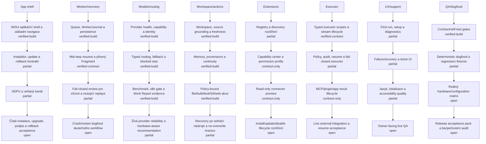

# Project codename: Jarvis

**Jarvis je interní codename projektu ve vývoji, nikoli finální produktový název.**

Cílem je bezplatná edice **Personal 1.0.0**. Až bude připravená k veřejnému vydání, bude zde zveřejněna pod jiným produktovým názvem.

Aktuálně zde není žádný veřejný instalační balíček ke stažení. Dřívější vývojové a beta buildy byly z aktuálního download kanálu odstraněny, protože neodpovídají cílové kvalitě a rozsahu verze 1.0.0.

<!-- JARVIS_IMPLEMENTATION_PROGRESS_BEGIN -->
## Personal 1.0.0 implementation tracking

**Synchronizovaný snapshot: 2026-08-23**

Hlavní číslo je konzervativní index z explicitních milestone evidence. Task Board dodává pouze strukturu kapitol a synchronizaci evidence.

### Grafický dashboard

Čísla jsou záměrně kreslená přímo na sloupcích, bodech, uzlech a milestone tiles. Tabulky níže drží jen stav, kontext a důkazní mezeru.

### Architektonické kapitoly

| Architektonická kapitola | Stav | Scope |
| --- | --- | --- |
| Aplikační shell, instalátor, update a veřejný kanál | `in-progress` | WDUi application shell; WiX/setup and update contract; ADPU/public-channel integrity |
| Worker core, konverzace, fronta a recovery | `in-progress` | worker queue and journal; durable execution and resume; model-continuity lifecycle |
| Model providery, profily, routing a fallback | `in-progress` | provider readiness and model catalog; role/task routing and fallback; benchmark and liveness evidence |
| Workspace, memory, source, patch, build, Git a web | `in-progress` | workspace/source grounding; memory and provenance; policy-bound file, build, Git and web actions |
| Extension discovery, manager a permissions | `in-progress` | registry and discovery; capability center and permission profiles; read-only connector preview |
| Policy-bound MCP, plugin a app executor runtime | `in-progress` | typed executor scopes; MCP/plugin/app result lifecycle; audit, resume and fail-closed policy |
| Owner-facing UX, diagnostika, support a lokalizace | `in-progress` | chat/project-first UX; diagnostics and support evidence; language and accessibility quality |
| End-to-end QA, dogfooding a bezpečnostní audity | `in-progress` | contract and self-test gates; long dogfood and live acceptance; hardware/configuration and safety evidence |

### Milestone evidence

| Kapitola | Milestone | Stav | Důkaz / mezera |
| --- | --- | --- | --- |
| App shell | WDUi aplikační shell a základní navigace | `verified-build` | Aktuální capability evidence uvádí warning-free build a contract/self-test gates pro WDUi/Jarvis vrstvy.; mezera: Čerstvé owner-facing vizuální a multi-monitor QA není uzavřené jako runtime acceptance.; typy: build, runtime |
| App shell | Instalátor, update a rollback kontrakt | `partial` | Instalační a update části jsou v architektuře a zdrojovém toku přítomné, ale veřejná P8 release QA je pouze partial.; mezera: Chybí uzavřený čistý install, upgrade a rollback acceptance pack pro Personal 1.0.0.; typy: contract, release-gate |
| App shell | ADPU a veřejný kanál | `partial` | Veřejný kanál a synchronizační kontrakt existují, ale samotná distribuce není důkazem funkčního release.; mezera: Je nutné dokončit a opakovaně ověřit end-to-end publikaci artefaktu, integritu a rollback hranice.; typy: contract, release-gate |
| App shell | Čistá instalace, upgrade, podpis a rollback acceptance | `open` | Release milestone je deklarovaný jako požadavek, nikoli jako uzavřený důkaz.; mezera: Chybí aktuální acceptance pack navázaný na konkrétní release candidate.; typy: roadmap |
| Worker/recovery | Queue, WorkerJournal a persistence | `verified-build` | Capability matrix uvádí queue, worker, typed recovery UI projection, durable evidence gates a skrytý parent/child process-restart self-test jako build/contract ověřené.; mezera: Skutečný crash/restart průchod reálného workflow, dlouhý providerový requeue a V5 owner-facing recovery workflow acceptance zůstávají samostatnými důkazy.; typy: runtime, self-test |
| Worker/recovery | Mid-step resume a přesný Fragment | `verified-contract` | Typed phase, target, digest a exact Fragment selection mají kontraktní self-test evidence.; mezera: Live provider replay a pokračování po skutečné mutaci nejsou tímto kontraktem prokázané.; typy: contract, runtime |
| Worker/recovery | Fail-closed review pro síťové a mutující replaye | `partial` | Fail-closed hranice jsou součástí kontraktů a policy runtime, ale jejich úplná Personal acceptance není uzavřená.; mezera: Chybí jednotný live receipt přes všechny privilegované a mutující replay cesty.; typy: contract, runtime |
| Worker/recovery | Crash/restart dogfood skutečného workflow | `open` | Roadmap požadavek je známý, ale aktuální receipt není v registru.; mezera: Dodat opakovatelný crash/restart test s identity, journalem, resume a owner review.; typy: roadmap |
| Models/routing | Provider health, capability a identity | `verified-build` | Current evidence covers provider/model identity, readiness and bounded routing contracts.; mezera: Živá dostupnost každého podporovaného endpointu není permanentně prokázaná.; typy: runtime, self-test |
| Models/routing | Typed routing, fallback a blocked stav | `verified-build` | Evidence-driven first-attempt routing a fallback gates jsou v current build evidence.; mezera: Runtime kvalita provideru a 75% first-tier KPI zůstávají measurement target, nikoli hotový výsledek.; typy: build, runtime, self-test |
| Models/routing | Benchmark, idle gate a Work Report evidence | `verified-build` | Registry, scenario validation, idle resource gate, executor a Work Report summary mají build/self-test důkaz.; mezera: Skutečný idle model run a nahromaděné live owner Work Reports nejsou nahrazeny self-testem.; typy: runtime, self-test |
| Models/routing | Živá provider reliability a hardware-aware recommendation | `partial` | Jeden čerstvý localhost Ollama receipt prokazuje průchod konkrétního benchmarkového scénáře; širší provider a hardware matrix zůstává otevřená.; mezera: Dodat opakované live replaye s exact-route, více endpointy/modely, truthful downgrade/blocked receipts a skutečnou hardware matrix.; typy: roadmap, runtime |
| Workspace/actions | Workspace, source grounding a freshness | `verified-build` | Workspace helpers, source grounding a deterministic project workflow mají current build evidence.; mezera: Úplná kombinatorická action matrix pro každý podporovaný projekt není uzavřená.; typy: runtime, self-test |
| Workspace/actions | Memory, provenance a continuity | `verified-build` | Global memory capture, retrieval, scope nodes, citations and owner review mají executable evidence.; mezera: Semantic inference, online sync a všechny current-state correction scénáře nejsou tímto důkazem uzavřené.; typy: contract, self-test |
| Workspace/actions | Policy-bound file/build/test/Git/web akce | `verified-build` | Policy-bound helper and workspace command paths mají fail-closed selection, output capture a journal evidence.; mezera: Live owner acceptance všech mutujících a browser/app cest není doložená jedním kompletním packem.; typy: runtime, self-test |
| Workspace/actions | Recovery po selhání nástroje a no-overwrite hranice | `partial` | Bezpečnostní guardy a recovery kontrakty existují, ale nejsou kompletně potvrzené napříč runtime cestami.; mezera: Dodat end-to-end receipts pro containment, no-overwrite, destructive guard a recovery po pádu procesu.; typy: contract, runtime |
| Extensions | Registry a discovery rozšíření | `partial` | Kontrakt discovery a capability boundary existují, ale P7 je owner-approved pouze early.; mezera: Chybí uzavřená registrace/discovery lifecycle evidence pro obecné extension typy.; typy: contract, release-gate |
| Extensions | Capability center a permission profily | `contract-only` | Permission model je architektonicky popsaný; kompletní current runtime evidence chybí.; mezera: Dodat implementovaný UI/runtime flow, persistence a negative-path self-tests.; typy: documentation |
| Extensions | Read-only connector preview | `contract-only` | Read-only preview je součástí roadmapového směru, ne uzavřený universal connector proof.; mezera: Dodat konkrétní connector fixture, source identity, permission review a ověřený render.; typy: roadmap |
| Extensions | Install/update/disable lifecycle rozšíření | `open` | Obecný lifecycle není v Personal evidence uzavřen.; mezera: Dodat safe install, update, disable, rollback, ownership a audit receipts.; typy: release-gate |
| Executor | Typed executor scopes a stream lifecycle | `verified-contract` | Typed executor scope contract a bounded result lifecycle mají current contract evidence.; mezera: Univerzální runtime acceptance pro každý MCP/plugin/app typ není uzavřená.; typy: contract, runtime |
| Executor | Policy, audit, resume a fail-closed executor | `partial` | Auditní a fail-closed principy jsou přítomné v kontraktech, ale cross-runtime proof je částečný.; mezera: Dodat jednotný audit/resume receipt a negative-path test pro všechny executor adapters.; typy: contract, runtime, self-test |
| Executor | MCP/plugin/app result lifecycle | `contract-only` | Result lifecycle je v architektuře popsán, ale generic integration evidence chybí.; mezera: Dodat typed fixtures pro success, partial, failure, timeout, retry a owner review.; typy: documentation |
| Executor | Live external integration a resume acceptance | `open` | Live MCP/plugin/app acceptance není doložena jako společný current receipt.; mezera: Dodat owner-approved, identity-bearing, reproducible live acceptance pack.; typy: release-gate |
| UX/support | First-run, setup a diagnostics | `partial` | Diagnostické a setup směry existují, ale P8 owner-facing QA je partial.; mezera: Dodat čerstvý owner walkthrough v podporovaných DPI/multi-monitor konfiguracích.; typy: build, runtime |
| UX/support | Failure/recovery a ticket UI | `partial` | Failure/recovery and Secure Ticket contracts exist, but P6 ticket runtime is early and P8 QA partial.; mezera: Dodat live owner review, sanitizer/lineage receipt and complete ticket UI path.; typy: contract, release-gate |
| UX/support | Jazyk, lokalizace a accessibility quality | `partial` | Localization accounting existuje, ale fallback backlog je explicitně otevřený a není důkazem hotové kvality.; mezera: Uzavřít překladový backlog a projít accessibility/DPI acceptance na reálném UI.; typy: runtime, self-test |
| UX/support | Owner-facing live QA | `open` | Žádný aktuální univerzální live owner acceptance receipt není v manifestu.; mezera: Dodat vizuální a interakční QA pack včetně accessibility, DPI a recovery scénářů.; typy: roadmap |
| QA/dogfood | Contract/self-test gates | `verified-build` | Current capability matrix uvádí warning-free build a více self-test gates.; mezera: Self-test nenahrazuje dlouhý dogfood ani reálnou konfiguraci ownera.; typy: build, runtime |
| QA/dogfood | Deterministic dogfood a regression fixtures | `partial` | Contract and dogfood scaffolding exist, ale potvrzené ticket-driven regression closure není úplné.; mezera: Navázat potvrzené chyby na immutable acceptance pack a regression fixture.; typy: contract, release-gate |
| QA/dogfood | Reálný hardware/configuration matrix | `open` | Owner-approved release source označuje hardware/configuration matrix jako early.; mezera: Dodat opakovatelná měření na skutečných konfiguracích s identity a environment receipts.; typy: release-gate |
| QA/dogfood | Release acceptance pack a bezpečnostní audit | `open` | Release readiness je samostatně 50 %, ale neprokazuje dokončený safety/release acceptance pack.; mezera: Dodat current release candidate, signed artifacts, clean install/upgrade/rollback a safety audit receipts.; typy: release-gate |

Detailní privátní zdrojové cesty, receipts a owner-specific data zůstávají v CPM evidence manifestu.

### Vývoj v relevantních revizích

Každý bod a změnová anotace jsou v grafu historie; každý anonymizovaný záznam zůstává i ve strojově čitelném JSON. Raw private source commit, subject ani interní cesta se do veřejného repa nekopírují.

| Veřejná revize | Datum | Změněné kapitoly | Milestone evidence events |
| --- | --- | --- | --- |
| `bbaf302ed395` | 2026-08-16 | evidence-only | — |
| `6cf1396eb9fd` | 2026-08-19 | evidence-only | — |
| `938c68511f2c` | 2026-08-19 | evidence-only | — |
| `9688beecfae4` | 2026-08-20 | evidence-only | — |
| `68934887ccb7` | 2026-08-22 | evidence-only | — |
| `a9a4671f1224` | 2026-08-23 | app-shell-release, worker-recovery, model-routing, workspace-actions, extensions-permissions, executor-runtime, owner-ux, qa-dogfood | 32: app-shell-release/wdui-shell-contract, app-shell-release/installer-update-contract, app-shell-release/adpu-public-channel, app-shell-release/clean-release-acceptance… |
| `5f45d9918221` | 2026-08-23 | evidence-only | — |
| `a6ae9a75975b` | 2026-08-23 | evidence-only | — |
| `196fc38b8d64` | 2026-08-23 | model-routing | 1: model-routing/live-provider-reliability |
| `13f566c02e0e` | 2026-08-23 | evidence-only | — |
| `ca88d35661d5` | 2026-08-23 | evidence-only | — |
| `177af37810f3` | 2026-08-23 | evidence-only | — |
| `fc5d758aab2f` | 2026-08-23 | evidence-only | — |
| `c75003eedbf8` | 2026-08-24 | worker-recovery, executor-runtime | 2: worker-recovery/queue-journal-persistence, executor-runtime/policy-audit-fail-closed |
| `310c131cb2df` | 2026-08-24 | worker-recovery, executor-runtime | 2: worker-recovery/queue-journal-persistence, executor-runtime/policy-audit-fail-closed |
| `f81c9bbb9dea` | 2026-08-24 | worker-recovery, model-routing | 2: worker-recovery/queue-journal-persistence, model-routing/typed-routing-fallback |
| `85e1f042f99c` | 2026-08-24 | worker-recovery | 1: worker-recovery/queue-journal-persistence |
| `0693f6322cdd` | 2026-08-24 | worker-recovery | 1: worker-recovery/queue-journal-persistence |

Úplná machine-readable historie: [progress-history.json](progress-history.json). Snapshot: [progress.json](progress.json).

### Release readiness

| Release oblast | Stav |
| --- | --- |
| Recovery a durable execution | `partial` |
| Model/provider spolehlivost | `advanced` |
| Intake, research a source quality | `partial` |
| Workspace a bezpečné akce | `advanced` |
| Memory a continuity | `advanced` |
| Secure Support Ticket | `early` |
| Supervised self-development | `early` |
| UX, installer, update a release QA | `partial` |
| Reálný hardware/configuration matrix | `early` |

### Měřicí kontrakt

- `primary`: vážené minimum implementace a ověření po jednotlivých milnících; milník bez ověřeného důkazu nemůže vytvořit hotovo.
- `implementation`: explicitní milestone state s horními stropy; architektura, source-size ani plán číslo nezvyšují.
- `verification`: explicitní evidence; kontrakt nebo build není totéž co live runtime nebo owner acceptance.
- `done`: vážené minimum na každém milníku, potom vážený roll-up kapitol a jejich evidence cap.
- `Task Board`: slouží k mapování kapitol, vah a synchronizaci odvozené evidence; není samostatnou skórovanou osou.
- Relevantní revize vzniká při změně nakonfigurovaných vstupů měření; commit bez změny evidence zůstává jako `evidence-only`.
- Plánovaný stav, historická dokumentace, source-size ani samotný commit nemohou zvýšit primary bez evidence manifestu.
<!-- JARVIS_IMPLEMENTATION_PROGRESS_END -->

## Co se připravuje

Personal 1.0.0 má být local-first osobní agent pro Windows, který může používat lokální modely, modely v LAN i uživatelem zvoleného providera a nemá vyžadovat povinný Jeniksoft inference cloud ani Jeniksoft tokenové platby.

Vývoj se nyní soustředí především na spolehlivost, recovery, bezpečnost akcí, práci s evidencí a zdroji, memory, support/reprodukci chyb, supervised self-development, instalaci/rollback a ověření na různých skutečných počítačích.

## Dostupnost

Veřejné datum vydání zatím není stanoveno. Verze 1.0.0 bude zveřejněna až po splnění release gates; samotný počet implementovaných funkcí není důvodem označit build za hotový.
