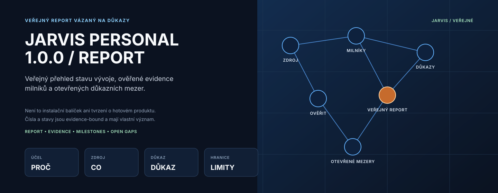

# Project codename: Jarvis

**Jarvis je interní codename projektu ve vývoji, nikoli finální produktový název.**

Cílem je bezplatná edice **Personal 1.0.0**. Až bude připravená k veřejnému vydání, bude zde zveřejněna pod jiným produktovým názvem.

Aktuálně zde není žádný veřejný instalační balíček ke stažení. Dřívější vývojové a beta buildy byly z aktuálního download kanálu odstraněny, protože neodpovídají cílové kvalitě a rozsahu verze 1.0.0.

## Zpětná vazba / Feedback

Jarvis je veřejně sledovaný vývojový projekt. Pro zpětnou vazbu použij prosím jednu z těchto cest:

- [🐞 Nahlásit chybu / Report a bug](https://github.com/jeniksoft/app-downloads/issues/new?template=bug_report.yml)
- [💡 Navrhnout zlepšení / Suggest an improvement](https://github.com/jeniksoft/app-downloads/issues/new?template=feature_request.yml)
- [💬 Otevřít diskuzi / Start a discussion](https://github.com/jeniksoft/app-downloads/discussions)

Do veřejných příspěvků nevkládej hesla, tokeny, osobní údaje ani celé soukromé logy. Přikládej pouze očištěné a nezbytné informace.

## Věkové omezení / Age restriction (18+)

**CZ:** Jarvis je určen výhradně dospělým uživatelům od 18 let. Pokud ti ještě nebylo 18 let, Jarvis nepoužívej.

**EN:** Jarvis is intended exclusively for adults aged 18 and over. If you are under 18, do not use Jarvis.

<!-- JARVIS_IMPLEMENTATION_PROGRESS_BEGIN -->
## Sledování implementace Personal 1.0.0

**Synchronizovaný snapshot: 2026-10-09**

### Ověření posledního roadmapového closeoutu

Řez `P5.20` je veřejně spojen se zdrojovým SHA `81d4318ce6a3b29278345aa1cd84fa78df25b25a` a closeout SHA `fb6acbe7b684b9ee705259aba8f90b307156bfca`. Stav: **verified**.
Tento přesný obal slouží k ověření uzavřeného řezu; běžné historické body zůstávají záměrně anonymizované.

Hlavní číslo je konzervativní index z explicitních milestone evidence. Task Board dodává pouze strukturu kapitol a synchronizaci evidence.

**Jazyk reportu:** čeština pro `cs*`; jiné locale používá anglický fallback. GitHub README je statický a jazyk se určuje při generování.

### Jarvis report

Tato stránka je veřejný report o stavu vývoje Jarvis Personal 1.0.0 vázaný na důkazy: ukazuje ověřenou implementaci, stav milestone a otevřené důkazní mezery.
Nejde o instalační balíček ani o prohlášení, že je produkt hotový; připravenost vydání je samostatná roadmapová brána.

### Grafický dashboard

Čísla jsou záměrně kreslená přímo na sloupcích, bodech, uzlech a milestone tiles. Časový graf sledovaného pokroku má na vodorovné ose anonymizované relevantní revize a delta anotace ukazují přírůstky mezi body. Tabulky níže drží stav, kontext a důkazní mezeru.

### Osobní Jarvis — vážený průběh

Personal 1.0.0 má celkový stav **37.48 %**. Hodnota uvnitř kapitoly zůstává oddělená od jejího globálního příspěvku; například 6% kapitola na 95% přidá 5,70 procentního bodu.

| Kapitola | Váha | Uvnitř kapitoly | Vážený příspěvek |
| --- | ---: | ---: | ---: |
| Aplikační shell, instalátor, update a veřejný kanál | 10.00 % | 31.25 % | 3.13 p. b. |
| Worker core, konverzace, fronta a recovery | 12.00 % | 43.75 % | 5.25 p. b. |
| Model providery, profily, routing a fallback | 10.00 % | 62.50 % | 6.25 p. b. |
| Workspace, memory, source, patch, build, Git a web | 14.00 % | 71.25 % | 9.98 p. b. |
| Extension discovery, manager a permissions | 16.00 % | 25.00 % | 4.00 p. b. |
| Policy-bound MCP, plugin a app executor runtime | 20.00 % | 25.00 % | 5.00 p. b. |
| Owner-facing UX, diagnostika, support a lokalizace | 10.00 % | 18.75 % | 1.88 p. b. |
| End-to-end QA, dogfooding a bezpečnostní audity | 8.00 % | 25.00 % | 2.00 p. b. |

### Roadmapa produktu

**Legenda ikon:** · ✅ Ověřeno · 🟦 Evidence · 🟠 Rozpracováno · ⚪ Plánováno · ⛔ Blokováno
Ikona i popisek jsou viditelné přímo v README; po najetí kurzorem tooltip vysvětlí význam a nezaměňuje implementaci za živé ověření.

**Změna od předchozího snapshotu: roadmapa položky +1 · hotovo +1 · ověřené důkazy +0**

Všechny podřezy a karty edic jsou v grafu výše; duplicitní textové tabulky se nezobrazují. Přesná strojová data zůstávají v přiloženém JSON snapshotu.

### Release gates

| Stav | Edice | Stručný popis | Ověření | Závislosti |
| --- | --- | --- | --- | ---: |
| 🟠 Rozpracováno | `personal-1.0.0` | Bezplatný local-first Jarvis pro jednoho člověka. | `V6` | 9 |
| ⚪ Pouze architektura | `teams` | Spolupráce v jednom zákaznicky vlastněném TeamRealmu. | `V6` | 12 |
| ⚪ Pouze architektura | `enterprise` | Rekurzivní zákaznicky vlastněná organizace a Konstelace. | `V6` | 10 |

Personal je měřený evidence-bound index. Teams a Enterprise jsou zatím roadmap-only a nemají aktivní procentní měření; veřejný report proto nezobrazuje falešnou nulu.

### Zdrojový inventář Jarvise

Rozsah `tools/jarvis` je čtený z `git archive HEAD`; fyzické řádky zahrnují i prázdné a komentářové řádky. Velikost je uvedená v desítkových MB (1 MB = 1 000 000 bajtů).

| Jazyk / obsah | Soubory | Fyzické řádky | Velikost (MB) |
| --- | ---: | ---: | ---: |
| C/C++ | 2 284 | 712 786 | 34.72 |
| JSON | 528 | 193 633 | 32.34 |
| Markdown | 1 065 | 142 668 | 7.72 |
| Python | 724 | 118 607 | 4.91 |
| PowerShell | 69 | 34 094 | 1.78 |
| Other text | 80 | 5 947 | 0.30 |
| JSONL | 16 | 2 515 | 6.93 |
| Plain text | 130 | 1 815 | 0.19 |
| INI | 8 | 703 | 0.04 |
| Shell | 2 | 501 | 0.02 |
| CMake | 2 | 146 | 0.01 |
| YAML | 3 | 16 | 0.00 |
| Encoded text | 13 | 13 | 0.06 |
| Nanity pseudocode | 2 | 13 | 0.00 |
| **Text/source celkem** | **4 926** | **1 213 457** | **89.01** |
| Binární assety (mimo řádky) | 41 | — | 14.68 |
| **Trackovaný strom celkem** | **4 967** | **1 213 457** | **103.69** |

### Přírůstek od předchozí revize

Delta je vůči předchozímu commitnutému snapshotu (`HEAD^`); kladná hodnota znamená přírůstek a záporná úbytek. U prvního commitu je baseline nedostupná.

| Oblast | Δ soubory | Δ fyzické řádky | Δ velikost (MB) |
| --- | ---: | ---: | ---: |
| Text/source celkem | +0 | +0 | +0.00 |
| Binární assety | +0 | — | +0.00 |
| Trackovaný strom celkem | +0 | +0 | +0.00 |

Binární assety jsou uvedené zvlášť, aby nebyly zaměněné za programovací jazyk. Tento inventář je informativní a nemění žádné procento dokončení, ověření, hotova ani release readiness.

### Architektonické kapitoly

| Architektonická kapitola | Stav | Scope |
| --- | --- | --- |
| Aplikační shell, instalátor, update a veřejný kanál | `in-progress` | WDUi application shell; WiX/setup and update contract; ADPU/public-channel integrity |
| Worker core, konverzace, fronta a recovery | `in-progress` | worker queue and journal; durable execution and resume; model-continuity lifecycle |
| Model providery, profily, routing a fallback | `in-progress` | provider readiness and model catalog; role/task routing and fallback; benchmark and liveness evidence |
| Workspace, memory, source, patch, build, Git a web | `in-progress` | workspace/source grounding; memory and provenance; policy-bound file, build, Git and web actions |
| Extension discovery, manager a permissions | `in-progress` | registry and discovery; capability center and permission profiles; read-only connector preview |
| Policy-bound MCP, plugin a app executor runtime | `in-progress` | typed executor scopes; MCP/plugin/app result lifecycle; audit, resume and fail-closed policy |
| Owner-facing UX, diagnostika, support a lokalizace | `in-progress` | chat/project-first UX; diagnostics and support evidence; language and accessibility quality |
| End-to-end QA, dogfooding a bezpečnostní audity | `in-progress` | contract and self-test gates; long dogfood and live acceptance; hardware/configuration and safety evidence |

Graf kapitol je v dashboardu výše jako statické SVG. Tato úplná textová tabulka je jeho přístupný fallback a nevyžaduje další renderer.

### Milestone evidence

| Kapitola | Milestone | Stav | Důkaz / mezera |
| --- | --- | --- | --- |
| App shell | WDUi aplikační shell a základní navigace | `verified-build` | Aktuální capability evidence uvádí warning-free build a contract/self-test gates pro WDUi/Jarvis vrstvy.; mezera: Čerstvé owner-facing vizuální a multi-monitor QA není uzavřené jako runtime acceptance.; typy: build, runtime |
| App shell | Instalátor, update a rollback kontrakt | `partial` | Instalační a update části mají provider-free P8.15.1-P8.15.13 evidence včetně host registry, signed-installer admission a bounded graph-registry publication; veřejná P8 release QA je stále pouze partial.; mezera: Chybí uzavřený čistý install, upgrade a rollback acceptance pack pro Personal 1.0.0 včetně živého installeru, nasazení služby, restartové orchestrace a owner workflow.; typy: contract, release-gate, self-test |
| App shell | ADPU a veřejný kanál | `partial` | Veřejný kanál a synchronizační kontrakt existují, ale samotná distribuce není důkazem funkčního release.; mezera: Je nutné dokončit a opakovaně ověřit end-to-end publikaci artefaktu, integritu a rollback hranice.; typy: contract, release-gate |
| App shell | Čistá instalace, upgrade, podpis a rollback acceptance | `open` | Release milestone je deklarovaný jako požadavek, nikoli jako uzavřený důkaz.; mezera: Chybí aktuální acceptance pack navázaný na konkrétní release candidate.; typy: roadmap |
| Worker/recovery | Queue, WorkerJournal a persistence | `verified-build` | Capability matrix a PF1.2 common durable envelope uvádějí queue, worker, typed recovery UI projection, durable evidence gates a skrytý parent/child process-restart self-test jako build/contract ověřené.; mezera: Skutečný crash/restart průchod reálného workflow, dlouhý providerový requeue a V5 owner-facing recovery workflow acceptance zůstávají samostatnými důkazy.; typy: runtime, self-test |
| Worker/recovery | Mid-step resume a přesný Fragment | `verified-contract` | Typed phase, policy, target, digest a exact Fragment selection mají kontraktní self-test evidence; closed vocabulary navíc odmítá neznámé, částečné a nesouhlasné vazby, P1.3 váže request/efektivní policy identity před consequential krokem s verified-only gate a P1.4 váže before/after digest stejné množiny targetů bez replaye mutace.; mezera: Live provider replay a pokračování po skutečné mutaci nejsou tímto kontraktem prokázané.; typy: contract, runtime, self-test |
| Worker/recovery | Fail-closed review pro síťové a mutující replaye | `verified-contract` | Provider-free fail-closed hranice a typed receipt continuity jsou deterministicky ověřené pro síťové, privilegované, mutující a resume cesty; úplná Personal acceptance není uzavřená.; mezera: Zbývá live a skutečný workflow důkaz přes všechny privilegované a mutující replay cesty.; typy: contract, runtime, self-test |
| Worker/recovery | Crash/restart dogfood skutečného workflow | `open` | Roadmap požadavek je známý, ale aktuální receipt není v registru.; mezera: Dodat opakovatelný crash/restart test s identity, journalem, resume a owner review.; typy: roadmap |
| Models/routing | Provider health, capability a identity | `verified-build` | Current evidence covers provider/model identity, readiness and bounded routing contracts.; mezera: Živá dostupnost každého podporovaného endpointu není permanentně prokázaná.; typy: runtime, self-test |
| Models/routing | Typed routing, fallback a blocked stav | `verified-build` | Evidence-driven first-attempt routing a fallback gates jsou v current build evidence.; mezera: Runtime kvalita provideru a 75% first-tier KPI zůstávají measurement target, nikoli hotový výsledek.; typy: build, runtime, self-test |
| Models/routing | Benchmark, idle gate a Work Report evidence | `verified-build` | Registry, scenario validation, idle resource gate, executor a Work Report summary mají build/self-test důkaz.; mezera: Skutečný idle model run a nahromaděné live owner Work Reports nejsou nahrazeny self-testem.; typy: runtime, self-test |
| Models/routing | Živá provider reliability a hardware-aware recommendation | `partial` | Jeden čerstvý localhost Ollama receipt prokazuje průchod konkrétního benchmarkového scénáře; širší provider a hardware matrix zůstává otevřená.; mezera: Dodat opakované live replaye s exact-route, více endpointy/modely, truthful downgrade/blocked receipts a skutečnou hardware matrix.; typy: roadmap, runtime, self-test |
| Workspace/actions | Workspace, source grounding a freshness | `verified-build` | Workspace helpers, source grounding a deterministic project workflow mají current build evidence.; mezera: Úplná kombinatorická action matrix pro každý podporovaný projekt není uzavřená.; typy: runtime, self-test |
| Workspace/actions | Memory, provenance a continuity | `verified-build` | Global memory capture, retrieval, scope nodes, citations and owner review mají executable evidence.; mezera: Semantic inference, online sync a všechny current-state correction scénáře nejsou tímto důkazem uzavřené.; typy: contract, self-test |
| Workspace/actions | Policy-bound file/build/test/Git/web akce | `verified-build` | Policy-bound helper and workspace command paths mají fail-closed selection, output capture a journal evidence.; mezera: Live owner acceptance všech mutujících a browser/app cest není doložená jedním kompletním packem.; typy: runtime, self-test |
| Workspace/actions | Recovery po selhání nástroje a no-overwrite hranice | `verified-contract` | Existující containment, WorkerJournal, post-mutation verify a rollback guardy mají společný provider-free failure/recovery receipt s no-replay a no-overwrite hranicí.; mezera: Zbývá skutečný pád procesu, end-to-end journal/read-back, rollback provedení a owner-facing runtime acceptance.; typy: contract, self-test |
| Workspace/actions | Allow-listované build/test presety | `verified-build` | P4.7 má provider-free source guard, nativní self-test a build evidence pro uzavřený registr workspace build/test presetů.; mezera: Živý provider, model, workspace, dlouhý build/test běh a owner acceptance zůstávají samostatnými branami.; typy: runtime, self-test |
| Workspace/actions | Read-only Git s přesnými hostitelskými argumenty | `verified-build` | P4.8 má provider-free source guard, nativní self-test a build evidence pro uzavřený registr read-only Git argumentů.; mezera: Provider, model, síť, živý workspace a owner acceptance zůstávají samostatnými branami; síťový fetch není povolen.; typy: runtime, self-test |
| Workspace/actions | Potvrzený Git commit/push s identitními receipty | `verified-build` | P4.9 má provider-free source guard, nativní receipt self-test a build evidence pro hostitelem vázaný Git commit/push.; mezera: Credentialy, provider, živý repozitář, crash/restart a owner acceptance zůstávají samostatnými branami.; typy: runtime, self-test |
| Workspace/actions | Potvrzená hranice otevření URL v browseru | `verified-build` | P4.10 má provider-free kontrolu URL, nativní receipt/self-test a build evidence pro hostitelem řízené předání URL výchozímu browseru.; mezera: WebView2 UI, skutečné síťové načtení, pozorování page-loadu a owner acceptance zůstávají samostatnými branami.; typy: runtime, self-test |
| Extensions | Registry a discovery rozšíření | `verified-contract` | Hostem dodaný registr rozšíření má provider-free kanonikalizaci obecných typů, stabilní snapshot identity, bounded manifest metadata a fail-closed runtime hranici.; mezera: Zbývá skutečné filesystem discovery, loader/executor, persistence read-back, restart a owner-facing acceptance.; typy: contract, self-test |
| Extensions | Capability center a permission profily | `verified-contract` | Capability Center a permission editor jsou napojené na existující WDUi, hostitelskou discovery/policy autoritu, persistence a audit; provider-free wiring a negativní policy testy prošly.; mezera: Zbývá owner-facing live UI acceptance, reálné extension execution a plná lifecycle acceptance.; typy: documentation, self-test |
| Extensions | Read-only connector preview | `verified-contract` | Konkrétní local/private GET a HEAD connector fixture, preview, source identity a permission refusal jsou ověřené v deterministickém extension-policy self-testu.; mezera: Zbývá live connector transport, owner-facing render acceptance a širší universal connector lifecycle.; typy: roadmap, self-test |
| Extensions | Install/update/disable lifecycle rozšíření | `verified-contract` | Provider-free evidence kontrakt uzavírá přesné přechody install/update/disable/rollback, vlastnictví, policy a auditní receipts bez udělení živé mutační autority.; mezera: Zbývá živý installer/executor, filesystem/process/network persistence, skutečný rollback/karanténa, crash recovery a owner-facing acceptance.; typy: release-gate, self-test |
| Executor | Typed executor scopes a stream lifecycle | `verified-contract` | Typed executor scope contract a bounded result lifecycle mají current contract evidence.; mezera: Univerzální runtime acceptance pro každý MCP/plugin/app typ není uzavřená.; typy: contract, runtime |
| Executor | Policy, audit, resume a fail-closed executor | `verified-contract` | Provider-free evidence hranice nyní typově pokrývá generický, privilegovaný, mutující a resume adapter nad existující policy, auditem, WorkerJournalem a read-backem; cross-runtime proof je stále částečný.; mezera: Zbývá live a skutečný workflow důkaz pro generické, privilegované a mutující adaptery.; typy: contract, runtime, self-test |
| Executor | MCP/plugin/app result lifecycle | `verified-contract` | Existující read-only app connector, MCP/plugin/app transport a vratná mutace mají doplněnou obecnou provider-free matici výsledků success/partial/failure/timeout/retry/owner-review s lineage a fail-closed authority hranicí.; mezera: Zbývá skutečný MCP/plugin stdio/process runtime, síťový transport, další mutační extension třídy, durable runtime read-back a owner-approved live acceptance.; typy: documentation, self-test |
| Executor | Live external integration a resume acceptance | `open` | Live MCP/plugin/app acceptance není doložena jako společný current receipt.; mezera: Dodat owner-approved, identity-bearing, reproducible live acceptance pack.; typy: release-gate |
| UX/support | First-run, setup a diagnostics | `partial` | Provider-status vrstva má provider-free typed first-run readiness a chat/project composer má nyní společnou baseline pro trvalý chat, projekt a přílohy zprávy; P8 owner-facing QA je stále partial.; mezera: Dodat čerstvý owner walkthrough v podporovaných DPI/multi-monitor konfiguracích, V5 live setup acceptance a skutečné tray recovery pro chat/project/attachments.; typy: build, runtime, self-test |
| UX/support | Failure/recovery a ticket UI | `partial` | Failure/recovery a Secure Ticket kontrakty existují; P6.1 typovaný stavový automat, P6.2 read-only evidence candidate refs, P6.3 shared sensitive-data boundary, P6.4 protected local draft store, P6.5 owner evidence selection review, P6.6 immutable prepared manifest digest, P6.7 bounded local export package, P6.8 read-only untrusted reproduction intake, P6.9 confirmed-bug regression lineage a P6.10 read-only runtime snapshot s diagnostickým read-backem mají build/self-test důkaz, ale P6.11 síťový backend, kompletní ticket UI a P8 QA zůstávají partial.; mezera: P6.7 local export, P6.8 untrusted import/reproduction, P6.9 regression lineage a P6.10 snapshot jsou ověřené bez sítě; P6.11 network backend, kompletní ticket UI path, live P6 runtime a owner-facing V5 acceptance zůstávají otevřené.; typy: contract, release-gate, self-test |
| UX/support | Jazyk, lokalizace a accessibility quality | `partial` | Localization accounting a P8.8 read-only release gate existují; fallback backlog je explicitně otevřený a gate jej správně odmítá jako release blocker.; mezera: Uzavřít překladový backlog independently reviewed memory a projít accessibility/DPI acceptance na reálném UI.; typy: runtime, self-test |
| UX/support | Owner-facing live QA | `open` | Žádný aktuální univerzální live owner acceptance receipt není v manifestu.; mezera: Dodat vizuální a interakční QA pack včetně accessibility, DPI a recovery scénářů.; typy: roadmap |
| QA/dogfood | Contract/self-test gates | `verified-build` | Provider-free autonomní Fly/interoception/contract self-testy prošly na přesném finálním QA hashi a je doložen jeden 30minutový headless soak; jde pouze o syntetický Core loop.; mezera: Důkaz nenahrazuje běh tray ani instalovaného Workeru, živou konfiguraci ownera nebo autonomní dispatch/recovery; R1, WAITING_CAPABILITY a production acceptance zůstávají neuzavřené.; typy: build, runtime, self-test |
| QA/dogfood | Deterministic dogfood a regression fixtures | `partial` | Contract a dogfood řídicí rovina včetně P7.1-P7.9 mají deterministické důkazy, ale potvrzené ticket-driven regression closure, skutečná production Nanity, mentor finding/live repair execution a plný sémantický ASM graf nejsou uzavřené.; mezera: Doplnit skutečnou Jarvis-authored Nanity, end-to-end P7.6/live důkaz, reálný mentor finding pro živé P7.8 provedení a úplnou bug-to-regression closure; P7.9 je pouze bounded source-backed refresh a plná semantic discovery zůstává otevřená.; typy: contract, release-gate, self-test |
| QA/dogfood | Reálný hardware/configuration matrix | `open` | Owner-approved release source označuje hardware/configuration matrix jako early.; mezera: Dodat opakovatelná měření na skutečných konfiguracích s identity a environment receipts.; typy: release-gate, self-test |
| QA/dogfood | Release acceptance pack a bezpečnostní audit | `open` | P8.9 nyní obsahuje deterministický evaluator immutable clean-install receiptu, P8.10 evaluator přesné pre-1.0 upgrade matice a P8.11 evaluator LKG rollback receiptu nad existujícím build/setup tokem, ale samotný V6 live acceptance pack stále není dodaný.; mezera: Dodat current release candidate, signed artifacts, skutečný clean install/upgrade/rollback a safety audit receipts.; typy: release-gate, self-test |

Graf milestone je v dashboardu výše jako statické SVG. Tabulka zachovává úplný stav, důkaz a mezeru i při nedostupném rich-display rendereru GitHubu.

Detailní privátní zdrojové cesty, receipts a owner-specific data zůstávají v CPM evidence manifestu.

### Vývoj v relevantních revizích

Každý bod a změnová anotace jsou v časovém grafu historie; tabulka uvádí přírůstky všech hlavních metrik oproti předchozímu bodu a každý anonymizovaný záznam zůstává i ve strojově čitelném JSON. Raw private source commit, subject ani interní cesta se do veřejného repa nekopírují; přesný identifikátor posledního closeoutu je pouze v samostatném ověřovacím obalu.

| Veřejná revize | Datum | Δ primary | Δ implementace | Δ ověření | Δ hotovo | Δ release readiness | Změněné kapitoly | Milestone evidence events |
| --- | --- | ---: | ---: | ---: | ---: | ---: | --- | --- |
| `07b5859e31ee` | 2026-10-08 | +3.53 | +0.00 | +3.53 | +3.53 | +0.00 | app-shell-release, workspace-actions, extensions-permissions, executor-runtime | 7: app-shell-release/installer-update-contract, workspace-actions/action-failure-recovery, extensions-permissions/extension-registry-discovery, extensions-permissions/capability-permission-center… |
| `cf073d36348c` | 2026-10-08 | +0.00 | +0.00 | +0.00 | +0.00 | +0.00 | executor-runtime | 1: executor-runtime/policy-audit-fail-closed |
| `6bce9db93ede` | 2026-10-09 | +0.75 | +0.00 | +0.75 | +0.75 | +0.00 | worker-recovery | 1: worker-recovery/fail-closed-replay-review |
| `93632bab3f55` | 2026-10-09 | +0.00 | +0.00 | +0.00 | +0.00 | +0.00 | evidence-only | — |
| `5471e4ff9041` | 2026-10-09 | +0.00 | +0.00 | +0.00 | +0.00 | +0.00 | evidence-only | — |
| `e4ced169983b` | 2026-10-09 | +0.00 | +0.00 | +0.00 | +0.00 | +0.00 | evidence-only | — |
| `3679e9ea20f4` | 2026-10-09 | +0.00 | +0.00 | +0.00 | +0.00 | +0.00 | evidence-only | — |
| `2094348f1d15` | 2026-10-09 | +0.00 | +0.00 | +0.00 | +0.00 | +0.00 | evidence-only | — |
| `a8c8eb4146c2` | 2026-10-09 | +0.00 | +0.00 | +0.00 | +0.00 | +0.00 | evidence-only | — |
| `21990a7a19f9` | 2026-10-09 | +0.00 | +0.00 | +0.00 | +0.00 | +0.00 | evidence-only | — |
| `0b4dc72edb88` | 2026-10-09 | +0.00 | +0.00 | +0.00 | +0.00 | +0.00 | evidence-only | — |
| `dcf6fd5f7bb6` | 2026-10-09 | +0.00 | +0.00 | +0.00 | +0.00 | +0.00 | evidence-only | — |
| `1cc7268d3603` | 2026-10-09 | +0.00 | +0.00 | +0.00 | +0.00 | +0.00 | evidence-only | — |
| `54e90334a958` | 2026-10-09 | +0.00 | +0.00 | +0.00 | +0.00 | +0.00 | evidence-only | — |
| `668502538662` | 2026-10-09 | +0.00 | +0.00 | +0.00 | +0.00 | +0.00 | evidence-only | — |
| `1e8623317bfc` | 2026-10-09 | +0.00 | +0.00 | +0.00 | +0.00 | +0.00 | evidence-only | — |
| `f1da41c8331b` | 2026-10-09 | +0.00 | +0.00 | +0.00 | +0.00 | +0.00 | evidence-only | — |
| `fa956f781916` | 2026-10-09 | +0.00 | +0.00 | +0.00 | +0.00 | +0.00 | evidence-only | — |

Úplná strojově čitelná historie: [progress-history.json](progress-history.json). Snapshot: [progress.json](progress.json).

### Úspora GitHub Actions

Historický baseline: starý režim by spustil **790** běhů, closeout režim **155**; odhadovaná úspora je **635** běhů (**80.38 %**).
Optimalizace běhu: 262 inkrementálních closeout bodů od posledního úplného baseline, žádný klon `app-downloads`, žádný úplný průchod soukromou historií a nejvýše jeden veřejný commit; bajtově se publikují jen změněné JSON, README, historické a SVG artefakty.
Historický baseline je oddělený od aktuálního inkrementálního výpočtu, aby se úspora nepředstírala z neúplné mělké historie.

### Release readiness

| Release oblast | Stav |
| --- | --- |
| Recovery a durable execution | `partial` |
| Model/provider spolehlivost | `advanced` |
| Intake, research a source quality | `partial` |
| Workspace a bezpečné akce | `advanced` |
| Memory a continuity | `advanced` |
| Secure Support Ticket | `early` |
| Supervised self-development | `early` |
| UX, installer, update a release QA | `partial` |
| Reálný hardware/configuration matrix | `early` |

### Měřicí kontrakt

- `primary`: vážené minimum implementace a ověření po jednotlivých milnících; milník bez ověřeného důkazu nemůže vytvořit hotovo.
- `implementation`: explicitní milestone state s horními stropy; architektura, source-size ani plán číslo nezvyšují.
- `verification`: explicitní evidence; kontrakt nebo build není totéž co live runtime nebo owner acceptance.
- `done`: vážené minimum na každém milníku, potom vážený roll-up kapitol a jejich evidence cap.
- `Task Board`: slouží k mapování kapitol, vah a synchronizaci odvozené evidence; není samostatnou skórovanou osou.
- Relevantní revize vzniká při změně nakonfigurovaných vstupů měření; commit bez změny evidence zůstává jako `evidence-only`.
- Plánovaný stav, historická dokumentace, source-size, počet řádků ani samotný commit nemohou zvýšit primary bez evidence manifestu; source inventory je pouze informativní.
<!-- JARVIS_IMPLEMENTATION_PROGRESS_END -->

## Co se připravuje

Personal 1.0.0 má být local-first osobní agent pro Windows, který může používat lokální modely, modely v LAN i uživatelem zvoleného providera a nemá vyžadovat povinný Jeniksoft inference cloud ani Jeniksoft tokenové platby.

Vývoj se nyní soustředí především na spolehlivost, recovery, bezpečnost akcí, práci s evidencí a zdroji, memory, support/reprodukci chyb, supervised self-development, instalaci/rollback a ověření na různých skutečných počítačích.

## Dostupnost

Veřejné datum vydání zatím není stanoveno. Verze 1.0.0 bude zveřejněna až po splnění release gates; samotný počet implementovaných funkcí není důvodem označit build za hotový.
